# Flamingo

(This was updated in August 2026 to remove old information, see original in the archive/ directory.)

Repo for sharing utilities for in-cave communication project using Meshtastic-based radios.  This is an extension of (but not affiliated with) the work done by the [Vangelis](https://github.com/semper-ad-fundum/vangelis) project.

With tongue-in-cheek, if flamingo must stand for something, then:

`FLAMINGO` - Forward Link And Mesh Interconnect Network Ground Operations !!!!! 


AKA -> Using Meshtastic radios for underground (cave) communication

This is a [youtube video](https://youtu.be/R3LtLcnrpAk) made by Jamie Moon of a test in Tumbling Rock Cave Preserve (Jackson County/AL/USA) on January 23/2026 in which we deployed a 15-hop network, with three wired segments (900 ft/274m, 800 ft/243m, 800 ft/243m). This video also gives an overview of the Flamingo project.

# Summary
The goal of Flamingo is to provide a reliable cave communication system that is:
- Versatile
- Affordable
- Efficient

Building off of the wealth of knowledge within Meshtastic, Flamingo is optimized for a cave (i.e. chain) topology while maintaining the ease and flexibility of the self-organizing mesh. Our hybrid nodes allow users to run wireless or wired communications to suit their needs or to better accommodate complex cave terrain. 

One of our top priorities is keeping the radios cheap to allow this technology to get into the hands of rescue organizations or exploration teams. We can currently produce radios for about 50 USD each and well under 700 USD for a field kit.

Ongoing testing has shown that Flamingo can be set up more quickly than existing military phone communication systems and we are continuing to get that time lower and improve network strength.

If you are new to radios or Meshtastic, take a look at the specs below, otherwise jump ahead for a deeper dive on what we've been doing.

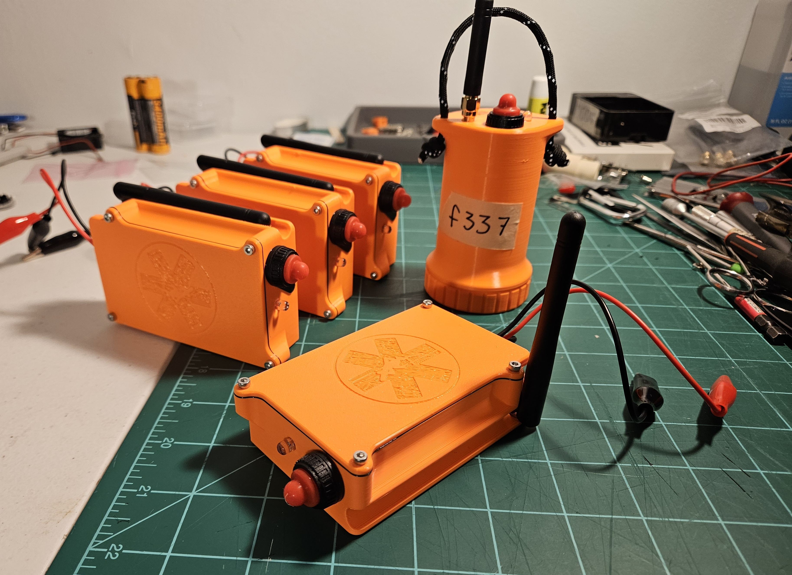

## Overview
- Allows sending and receiving text messages from deep within cave among team members and out to Incident Command
- Direct message or use dedicated private channels
  - Any technician with smartphone can connect easily
  - All messages are AES128 encrypted
- Deployments can use either wireless-only or a mixture of wireless + wired (hybrid) nodes
  - Max wired length between one pair of phone depends on data rate, ie. 9600 bits/second can drive 2400 feet of wire
  - Wired connections can use standard 2-conductor field phone wire
- Max hop-length extended to 255 (not that you would ever want to use this!)

## Operability
- Works with Android or iPhone using free Meshtastic application
- Self-organizing mesh network optimized for long chains
  - No special configuration needed
- Utilizes modified Meshtastic software
  - Supported by community developers
- Utilizes swappable 18650 Li-ion batteries
- Compatible with CalTopo and ATAK

## Current Kit Specifications
- Battery life:
  - Estimated 10+ days per charge
- Range (Radio):
  - 130-320ft (40-100m) between nodes
- Range (Wired):
  - Depends on data rate, 4800 bits per second can drive 4700 ft (1.4 km) 
- Ingress:
  - Water resistant (estimated IP55 for Cavenode V2)
- Weight/Volume:
  - <6oz (160g) per radio
  - <8lbs per field kit
  - 12 Cavenodes or 8+ Hybrid nodes fit in 10L hard case

# Table of Contents

- [Project Background](#project-background)
  - [Node Nomenclature](#node-nomenclature)
  - [Radio Setup](#radio-setup)
  - [Radio Hardware](#radio-hardware)
  - [Mesh deployment in a cave](#mesh-deployment-in-a-cave)
  - [Buzzer Haptic](#buzzer-haptic)
  - [LORA Speed Mode](#lora-speed-mode)
  - [Radio Device Roles](#radio-device-roles)
  - [Incident Command](#incident-command)
- [Firmware Repo and changes](#firmware-repo-and-changes)
  - [Firmware Changes](#firmware-changes)
  - [Pre-Built Firmware files](#pre-built-firmware-files)
  - [Firmware Build Targets](#firmware-build-targets)
  - [RS485 Serial link modification](#rs485-serial-link-modification)
  - [RS485 Connection](#rs485-connection)
  - [RS485 Collision](#rs485-collision)
  - [Hop Limit Extension](#hop-limit-extension)
  - [Router Rebroadcasts vs Retries](#router-rebroadcasts-vs-retries)
  - [Direct Messages and Public/Private Keys](#direct-messages-and-publicprivate-keys)
- [Utility Software](#utility-software)
- [Testing](#testing)
  - [Tumbling Rock Cave Preserve / Alabama /US   April 4, 2025](#tumbling-rock-cave-preserve--alabama-us---april-4-2025)
  - [Tumbling Rock Cave Preserve / Alabama /US   June 6, 2025](#tumbling-rock-cave-preserve--alabama-us---june-6-2025)
  - [Guffey Cave / Alabama /US   June 27, 2025](#guffey-cave--alabama-us---june-27-2025)
  - [HCRU Cave Rescue Class Scenario/ Guffey Cave / Alabama /US   August 3, 2025](#hcru-cave-rescue-class-scenario-guffey-cave--alabama-us---august-3-2025)
  - [HCRU/Chattanooga Cave Rescue/Jackson County Rescue Mock/ Tumbling Rock Cave / Alabama /US   Sept 27, 2025](#hcruchattanooga-cave-rescuejackson-county-rescue-mock-tumbling-rock-cave--alabama-us---sept-27-2025)
    - [So why did the mesh used in the Tumbling Rock Mock have initial reliability problems?](#so-why-did-the-mesh-used-in-the-tumbling-rock-mock-have-initial-reliablity-problems)
  - [Hop Latency/Range Testing - October 2025](#hop-latencyrange-testing---october-2025)
  - [Traceroute/External Antenna on Cave Nodes Testing, December 2025](#tracerouteexternal-antenna-on-cave-nodes-testing-december-2025)
  - [Firmware 2.7.15 testing, January 2026](#firmware-2715-testing-january-2026)
  - [Tumbling Rock Cave Preserve test, January 23/2026](#tumbling-rock-cave-preserve-test-january-232026)
  - [Tumbling Rock Cave Preserve test, March 20/2026](#tumbling-rock-cave-preserve-test-march-202026)
  - [HCRU Cave Rescue Class / Hughes Cave and Guffey Cave / Alabama /US --  August 1/2, 2026](#hcru-cave-rescue-class--hughes-cave-and-guffey-cave--alabama-us-----august-12-2026)
- [Tutorial Documents](#tutorial-documents)
  - [A. Basic Radio Operation](#a-basic-radio-operation)
  - [B. Installing the Python Command Line Interface for Meshtastic](#b-installing-the-python-command-line-interface-for-meshtastic)
    - [B.1 Install Python](#b1-install-python)
    - [B.2 Install the Python Meshtastic package](#b2-install-the-python-meshtastic-package)
    - [B.3 Testing the Python Meshtastic package](#b3-testing-the-python-meshtastic-package)
  - [C. Installing Git and Cloning the Flamingo Repo](#c-installing-git-and-cloning-the-flamingo-repo)
    - [C.1 Git Installation](#c1-git-installation)
    - [C.2 Cloning the Flamingo Repo](#c2-cloning-the-flamingo-repo)
  - [D. Installing new firmware to a radio](#d-installing-new-firmware-to-a-radio)
  - [E. Configuring Radio settings](#e-configuring-radio-settings)
    - [E1. The configure_node_2_7.py script](#e1-the-configure_node_2_7py-script)
    - [E2. Creating a spreadsheet of all radio settings with gen_csv.py](#e2-creating-a-spreadsheet-of-all-radio-settings-with-gen_csvpy)

# Project Background

We are members of the Huntsville Cave Rescue Unit [HCRU](https://www.hcru.org/) and one of our members (J. Moon) saw the Vangelis work and thought this could be useful in a cave rescue situation.  We use wired comms for cave rescues, but the problem is that the decades-old field phones that are used have no readily-available replacements, so a more modern approach is needed.  Dane Evans, New South Wales Cave Rescue (Australia) and regular Meshtastic firmware/Android app contributor, is also working with us. 

After looking at the Vangelis work, J. Moon recruited some tech-minded folks from the unit, and we started working.  The [Vangelis](https://github.com/semper-ad-fundum/vangelis) site gives a good summary of their attempt at using Meshtastic radios in a cave, and we used their tips on how to configure radios and what to expect when radios are placed in a cave.

A cave environment is much different from open air, with radios needing to be placed within near LOS of each other to form a linear chain (not a mesh) that forwards packets to/from the surface.   One of the challenges is the max hop limit of 7 that is in the current Meshtastic firmware - this limit is because two 3-bit fields (`hop_limit` and `hop_start`) are used in the packet header to track hops. The `hop_limit` is set to the max hop limit configuration setting.  The `hop_start` field is the max hop limit that the packet started with, and is decremented each time the packet is forwarded. The difference between `hop_limit` and `hop_start` is the number of hops the packet has traveled.  When `hop_start` reaches 0, the packet is no longer forwarded.

Meshtastic guidance is that 3 is typically a sufficient value for maximum hops for most mesh mesh configurations to avoid packet congestion. However, our configuration is a linear chain, so mesh congestion is not an issue. We require more hops than 7, with the maximum feasible limit to be discovered through testing.

## Node Nomenclature

When deploying a mesh in the cave, we split radios into two categories:

- Relay nodes - these are radios that are placed by the comms team and are used to relay packets back to Incident Command outside of the cave. Once placed, a relay node does not move. Rescuers do not pair to these nodes.  The Device Role for these radios are ROUTER (more on this later). 
- Rescuer nodes - these are radios that are given to rescuers, where the rescuer pairs to the radio assigned to them and carries it with them in the cave. The Device Role for these radios are either CLIENT_MUTE or CLIENT.  Packets travel from a rescuer phone (bluetooth) to rescuer radio, then from rescuer radio to a nearby relay radio, and then out the cave to IC via the relay radio mesh.

## Radio Setup

We have two channels in our radio YML configuration files, `AdminUse` (channel 0), and `General` (channel 1). Our usage of these channels is:

- The `AdminUse` channel should be used by Incident Command (IC) and the comms team when setting up the mesh.  Non-comms team rescuers are advised to mute this channel. Range test packets which are output during mesh setup all go to channel 0, and can be distracting for non-comms team members.
- The `General` channel is used for all rescue communication

We do not use direct messages as radios must know each other's public keys which can be a hassle to manage. For channel messages, a radio only needs the key for the channel.
Also, direct messages just mean a different tab to watch in the phone app which can be distracting.  We discourage (but obviously cannot prohibit) rescuers from using direct messages for rescue communication.

See the section on [Utility Software](#utility-software) for information on a python utility for easily configuring radio settings -- it is important that all radios have common settings for things like LORA speed mode and channels before deployment.


## Radio Hardware

There are dozens of radio types that are compatible with the Meshtastic firmware.  The CPU/radio combination that we use is the RAKwireless RAK4631 module + WisMesh board for expansion.  This has a NR52 series CPU + bluetooth radio + LORA radio.  Its principal advantage is that it is very low power; typically our radios can run for over a week continuously on an 18650 battery.  Its disadvantage is that it is a bit more expensive than some other cpu/radio combinations like the ESP32 CPU.  

We have tested our Meshtastic forked firmware with CPUs/Radios other than the RAK4631 for curiosity purposes, but all of our deployed radios use the RAK4631 module. We purchase RakWireless products from [Rokland](https://store.rokland.com), based in Florida, USA.

Our unit radios use the RAKwireless WisBlock Meshtastic Starter Kit (RAK4631 module + RAK19007 WisBlock base board) installed in a 3D printed enclosure.  For off-the-shell radios, we like the RAKwireless WisMesh Pocket V2 all-in-one, also available from Rokland. These make for good rescuer radios.

The hybrid node that supports a wired link between nodes uses the RAK5802 RS485 module which can also be purchased either directly from RAK Wireless or from Rokland for less than $10 USD. This module plugs into the RAK19007 WisBlock base board.

Our built radios come in two flavors:
  - Wireless only nodes
  - Hybrid nodes - supports either wireless or a wired serial connection (via RS485). We also refer to Hybrid nodes as 'Bridge' nodes (bridge between wireless and wired).

We have been gravitating to only using Hybrid nodes as relay nodes so as to not have to pre-decide how many wireless vs hybrid nodes to use in the mesh - if all the relay nodes are hybrids, then any of them then can support a wired connection if needed.

## Mesh deployment in a cave

This section gives some generalities about how to set up a mesh in a cave; exact details one some of the steps are given later. 

It is assumed that the comms team is already familiar with the general cave layout and have a plan for what sections of the cave will need wired connections (ie., the passage is twisty or narrow or both) and which sections of the cave lend itself to wireless relay nodes.

A wire connection is easy; just run the comms wire between two hybrid nodes without exceeding the maximum distance for the given programmed bit rate.  Our radios all used 9600 bits/per/second, which can drive approximately 2400 feet of wire. Our wire spools typically have 800 feet on them, so just two hybrid nodes could consume three wire spools.

Placing a wireless relay chain can be faster than laying down wire, once the team is practiced at it.  The methodology is:

1. Place a wireless relay node (ie. Node A)
2. A comms team member enables range test sending on Node A.  Range test sends out packets at fixed intervals (i.e every 10 seconds) on the broadcast channel 0, and these packets arrive at radios in range but are not forwarded from those radios. The receiving radio can see the SNR (signal to noise ratio) of the received packet (starts at 12 DB and goes down with distance, can become negative.)
3. The comms team moves away from Node A and watches the average SNR value of arriving packets - we use a minimum average SNR of 3.0 as the indication that a new relay node must be placed.
4. Place the next relay node (ie, Node B). 
5. Disable range test on Node A.
6. Send a test message to Incident Command (assumed located outside of the cave) and request a hard acknowledgement to verify a solid link to IC.  You could also do a trace route to the IC radio instead of message.
6. Enable range test on Node B and continue into the cave.

All comms chatter during setup should be on the `AdminUse` channel (channel 0).  Range test packets go to channel 0 as well.
Details on enabling/disabling range test are given later in this document.

When monitoring SNR during range test, you will notice that the SNR will bounce around as you move -- you should occasionally pause and let it settle.  Be conservative in placing nodes as a relay chain is only as strong as its weakest link.

When placing relay nodes, try to use some numerical ordering based on the short name (WP01, WP02, WP03, ...). This makes it easier to debug the chain via trace route if comm problems arise.

Our hybrid nodes (and some older generation nodes) contains a buzzer that beeps as follows:
1. Four beeps on power up
2. During range test, beeps are: one beep is for SNR average >=6, two beeps if  6 > SNR average >= 3, and three beeps if 3 > SNR average.  A buzzer is only for convenience, as SNR average is printed in the range test packet.  This allows you to walk forward without constantly monitoring the phone. You should never place a relay node if the average SNR is negative.

To enable range test on a remote node, send 'ADRT on <shortname>' in a broadcast channel (ie. ADRT on WP03) -- capitalization is used for emphasis only. The <shortname> is the target node to enable range test. To disable range test, send 'ADRT off' in a broadcast channel - all nodes that receive this will turn off range test. These are examples of `admin` commands that are explained in more depth later in this document.

When placing relay nodes, it is __EXTREMELY IMPORTANT__ that the radio used by the comm team member listening for range test packets from relay nodes use the same antenna configuration as the relay nodes themselves.  See the section on [So why did the mesh used in the Tumbling Rock Mock have initial reliability problems?](#so-why-did-the-mesh-used-in-the-tumbling-rock-mock-have-initial-reliablity-problems) for an example of what can happen when this rule is not followed.

## Buzzer Haptic

The current buzzer that we use is the [Grove Buzzer] (https://wiki.seeedstudio.com/Grove-Buzzer/) from SeeedStudio.  It is a high true, active buzzer on a small PCB. We just stuff this into our 3D enclosure.  We have also used a low-true active buzzer purchased from Amazon (search for Active Buzzer Module, 5V Piezoelectric Alarm, DIYables store) but prefer the Grove buzzer as it is a smaller form factor.

## LORA Speed Modes

In our cave testing, we used MEDIUM/SLOW for our mocks/testing through October 2025. However, after the September 2025 Tumbling Rock cave rescue mock, we did some detailed hop latency/range testing (see the dedicated section on this). This resulted in a decision to use SHORT Range/FAST speed going forward in order to reduce latency over a large number of hops and to keep TX contention low. The distance that wireless nodes can practically reach in a cave means that the range difference between MEDIUM and SHORT modes is not that significant, and that we would rather have lower latency/less contention.  Wired segments with bridge nodes can be used to cover long distances with wireless nodes used to bridge gaps or reach vertically if needed.

We used the SHORT Range/FAST mode in the 2026 Cave Rescue class and we noticed little difference from 2025 node placements in the same cave, and the mesh worked flawlessly.

## Radio Device Roles

First, using the `CLIENT` role for all nodes will work, but is not optimal as explained below. We used the `CLIENT` role exclusively for a long time before we learned that using different roles can improve both latency and chain debugging.

There are three device roles that we use for cave nodes:

- `ROUTER` - this role is used for relay nodes that form the primary communication chain. The principle reason to use this role is because it has much lower latency when rebroadcasting packets than a role like `CLIENT`.  The following [blog post](https://meshtastic.org/blog/demystifying-router-late/) has a great explanation of how the different roles calculate latency when rebroadcasting packets.  As an example of the latency difference, a seven-node chain of all CLIENT nodes had an end-to-end latency of about 10 seconds for a channel message using LORA SHORT/FAST mode, while the same seven-node chain only had a one to two second latency when all nodes had ROUTER roles.

- `CLIENT` - this can be used for rescuer radios who will be going in and out of range of the primary communication chain or who are extending past the end of the primary communication chain. This role rebroadcasts packets like the `ROUTER` role, but with a longer latency.  By rebroadcasting, these nodes can dynamically extend comms past the primary communication chain.

- `CLIENT_MUTE` - this role should be used for rescuer radios that are always in range of the primary communication chain. One reason to use this role is that packets are not rebroadcast which reduces TX contention.  A second reason is that when trying to debug a weak link in the communication chain you do not want nearby rescuer radios rebroadcasting packets, which will obfuscate your attempts to locate a weak link in the primary communication chain.

In the 2026 Cave Rescue class, we used this assignment methodology and it worked well. The only drawback of `CLIENT_MUTE` is that if a radio is only in range of other `CLIENT_MUTE` radios, then it will report a `MAX RETRANSMIT` error on any message since it will not hear the packet echoed by the other `CLIENT_MUTE` radios that received the packet. This can be confusing, as the other radios in range probably received the packet, they just did not echo it.

## Incident Command

We use a Windows laptop at Incident Command to log all messages. Initially, we just used Visual Studio code to record the debugging messages from the connected IC radio, and then used a custom python utility to parse the messages from the debug log. 

However, this proved to be insufficient in terms of log clarity, so a Windows Desktop app based on Python + Qt was developed for this purpose. This is located in the `meshapp` folder, see the README in that folder for more details. This is a relatively new app (developed in early summer 2026) and is undergoing rapid changes. We used it to good effect for the first time at our August 2026 cave rescue class and it worked well.

The responsibilities of Incident Command are:
- Hand out rescuer radios and rename the owner name (long name) to something appropriate when a radio is assigned.  This reduces confusion in the channel chat if the long name accurately reflects the sender. After a radio is renamed, power-cycle the radio so that is sends out a node information packet with the new long name. Radio renaming can either done from the phone app or by plugging the radio into a serial cable attached to the IC laptop and using the python Meshtastic command line interface.
- Monitor the incoming messages and respond as appropriately with either replies or tap-backs or general messages.
- Assist the comms team during mesh setup with ack responses to comm team messages to ensure the comms team has a good link back to IC

Once all radios are handed out, it is a good idea to send the admin command `ADNI` to a broadcast channel. This causes all radios to schedule a node-information packet sometimes in the next 15 minutes (slot time is randomly chosen by each radio). This is needed so that all radios get updated with the correct long names for radios in the mesh -- radios that were renamed may still be under the previous long name in a radio that was turned on after the initial radio renaming.

# Firmware Repo and Changes

The original firmware [repo](https://github.com/rbreesems/firmware) which was a fork of the official Meshtastic repo has been retired.
The new firmware repo is the rbreesems/Flamingo-Firmware [repo](https://github.com/rbreesems/Flamingo-Firmware) is a fork of a repo setup by Dane Evans [Flamingo Repo](https://github.com/DaneEvans/Flamingo-Firmware)  that has the Flamingo firmware changes and checks integration into the Meshtastic main firmware branch as new releases are made, to ensure that we can stay abreast of Meshtastic development and are not tied to a single Meshtastic release.

Pre-built firmware is placed in this repo in the `firmware/tested` directory. As of August 2026, the current firmware builds are in the 2.7.25 directory. If you wish to build these yourself, look at the `flamingo_v2.7.25_add` branch in the new firmware  [repo](https://github.com/rbreesems/Flamingo-Firmware).  You can also look at the DaneEvans repo if you want to build firmware yourself that targets later versions.  The branches in the rbreesems Flamingo-Firmware directory will always lag behind those on the DaneEvans repo as it takes time to vet new builds for the 30+ radios that we have in our equipment trailer.  No attempt will be made to verify every minor Meshtastic release. When a major release is done, we will wait for a few minor releases before moving to release unless Meshtastic phone App updates force us to move faster.

## Firmware Changes

These are all the firmware changes in the 2.7.25 builds that differ from the Meshtastic stock firmware:

- Packet header has been changed to support a hop limit up to 255, but firmware has it limited to 31 (you do not want a hop chain longer than this for latency/reliability reasons).  See the section on hop limit modification for a discussion of this change. The most important ramification is that radios with this firmware can only talk to radios with the same firmware.

- LCD splash screen displays Flamingo firmware version name.

- Range test is now enabled even when GPS code is excluded. Also, range test data is never saved to storage.

- Range test messages sent to the phone now have the RX RSSI/SNR for the received packet. RSSI is a negative number that increases in absolute value with increasing distance between TX/RX nodes.  SNR (Signal to Noise ratio) ranges from about 12 db max to negative numbers. We have found that SNR is the best indicator (> 3.0 dB) of packets being received reliably for long hop chains.

- Admin commands have been added that work on either the broadcast channels or via direct messages.  Admin commands are case insensitive (capitalization shown for emphasis only).  Admin commands used for instructing remote radios to perform some action (there is a capability built into Meshtastic but it is too cumbersome to configure and use).

Because admin commands are used in a broadcast channel,  the first word of an admin
command was chosen to be cryptic so as not to be part of a normal status message. The commands below have capitalization for emphasis, but parsing is case-insensitive.

  - `ADRT on <shortname>`  -- broadcast channel, turn on range test (default delay between packets set by node configuration file) for target radio `<shortname>`
  - `ADRT off`  -- broadcast channel or Direct Message (DM), turn off range test (no radio target is needed, any radio in range will turn off range test sending)
  - `ADRT delay <5|10|15|30|60>`  -- broadcast channel or (DM), set delay for between packets. Only 5, 10, 15, 30, or 60 is recognized.
  - `ADRT on` -- as a Direct Message, enables range test sending on the receiving node. This has no effect if sent in the broadcast channel as it has no specific target.
  - `ADNI` -- broadcast channel,  all receiving nodes will send out a node information packet within the next 15 minutes (each node randomly chooses a time). The need for this command is discussed later in this document.
  - `ADNI <shortname>` -- broadcast channel, only the target node will send a node information packet.

- Support for serial link via the RAK5802 RS485 module - see the detailed section below.

- Support for a heartbeat LED (blinks every two seconds) - useful for locating nodes that have been placed in the cave. 

- Support for a buzzer haptic that beeps based on SNR average during range testing During range test, a running average of the last three SNR packets is computed.  A node with a buzzer outputs three beeps if SNR average is less than 3.0, two beeps if less than 6, and one beep otherwise.  Three beeps is considered a bad placement and the node should be moved closer to the previous relay node. The buzzer can be configured to be either active or passive, low or high true via compilation flags.

- TraceRoute support has been extended to 19 hops and made more reliable (see the detail section on hop latency testing/TraceRoute). 

- Retries for channel messages have been added (default configuration is for two retransmits on failure, stock firmware has none), and retries direct messages even if there is no known neighbor (stock firmware only retries if there is a known neighbor). See the section that discusses retry behavior for the rationale for these changes.

## Pre-Built Firmware files

The firmware/tested/fw2.7.25 contains the latest pre-built firmware files as of August 2026. The `xmit2` tags mean that these builds are configured for 2 retries for broadcast packets (retries are used if a node does not hear a neighboring mesh node echo the packet it just sent).

1. `rak4631-firmware-wismesh-pocket_2.7.25_xmit2.uf2` -- WisMesh pocket
2. `rak4631-firmware-wismesh-pocket-active-buzzer-lowtrue-io3_2.7.25_xmit2` - WisMesh pocket build with a low-true active buzzer on io3
3. `rak4631-hybridnode-active-buzzer-hightrue-ain1-led-i2cscl1_2.7.25_xmit2` - Hybrid node build has heartbeat led on `i2cslc1` (pin available on RAK5802 RS485 connector) and a high true buzzer on pin `ain1` (accessible from the RAK19007 WisBlock base board).

## Firmware Build Targets

If you build the firmware yourself, the file `variants/nrf52840/rak4631/platform.ini` contains the following build targets for various flavors of nodes.
Our code changes are protected by various compile compilation flags that contain `FLAMINGO` in it so the code can be compiled to standard Meshtastic base if desired.

The build targets are: 

1. `env:rak4631` - this target compiles to standard Meshtastic firmware
2. `env:rak4631_flamingo` - has `-D FLAMINGO` compile flag, just contains hop limit/admin/trace route modifications, suitable for a generic rak4631 device like a WisMesh Pocket
3. `env:rak4631_slink` - `env:rak4631_flamingo` + enables serial link modifications - used for hybrid build without heartbeat LED/Buzzer
4. `env:rak4631_buzzer` - `env:rak4631_flamingo` + enables buzzer modifications - flags are set for active low true buzzer.
5. `env:rak4631_cavegen2` - `env:rak4631_flamingo` + enables buzzer modifications + heartbeat led, intended for our 2nd gen cave node
6.  `env:rak4631_slinkbuzzer` - `env:rak4631_flamingo` + enables serial link modifications with high true active buzzer (AIN1) and heartbeat LED on the RS485 module connector (I2C1_SCL). This code disables the I2C functionality.

On the Hybrid Nodes, aka serial link nodes (RAK19007 Wisblock base board + RAK4631 module + RAK5802 RS485 module) we have discovered that IO1 and IO2 appear to be shorted to each other on the RAK5802 RS485 board.  According to the RAK5802 documentation, IO1 is a low-true signal used to disable the RS485 interface, so our code always keeps it in the high state (we never disable the RS485 interface). We tried using IO2 for the heartbeat LED, but found that RS485 operation became erratic with blink enabled. We then discovered that IO2 was always high, the same state as IO1, and it is suspicious that IO1 and IO2 are directly across from each other on the RAK19007 I/O connector. The conclusion is that IO1 and IO2 are shorted, and that blinking IO2 periodically enables/disables the RS485 interface, causing erratic operation. 

This is why we ended up using the I2C1_SCL output on the RS485 module connector for the heartbeat LED and disabled the I2C functionality.

## RS485 Serial link modification

The `slink` targets in the `platformio.ini` enable the serial link code. This code is meant for a RAK19007 Wisblock base board + RAK4631 module + RAK5802 RS485 module (installed in the IO slot of the Wisblock base board). This firmware modification sends/receives packets out the RS485 port in addition to the LORA link. This is intended to be used to hard link a pair of radios in a cave where wireless between the two radios is impractical.  The 
RAK5802 RS485 module uses the RXD1, TXD1 ports, so do not use this software with a board that has something connected to these ports, like the WisMesh Pocket radio that has a built-in GPS connected to this port. 

Our terminology for radio that has the RS485 interface is `bridge node`, as it allows bridging between the wireless/wired worlds (we also call it a `hybrid node`).

The maximum working baud range for a short wire (< 2 feet) was found to be 230400 baud. 

Baud rate vs range testing with field-phone two-conductor field-comm wire yielded:

  - 115200 can drive 100 ft
  - 57600 can drive 700 ft
  - 19200 can drive 1400 ft
  - 9600 can drive 2400 ft 
  - 4800 can drive 4700 ft (1.4 km) 
  - 2400 can drive 5500 ft (1.6 km, do not know max distance,  suspect it is approximately 3 km - 9800 ft )

Wire types - gauge, twisted vs non-twisted makes a difference.

  - 1000 ft two wire, 22 AWG solid conductor, non-twisted - works @9600 but not @19200
  - 1000 ft two wire, 23 AWG solid conductor, twisted - works @19200 but not @38400

Any packet received over RS485 RX is echoed over LORA TX; a packet received over RS485 RX is delivered to the firmware stack in the same manner as a packet received by LORA RX. Any packet received over LORA RX that is rebroadcast by the router is also sent over RS485 TX. Packet flow on the RS485 serial link is bidirectional, but does not support full duplex (simultaneous TX and RX).

Our procedure for testing if the hard link works between a pair of radios is as follows. This test assumes that the only two radios in range are the two hard linked radios that are being tested.

Connect two radios via the hard link, then bluetooth connect to each radio with the phone app, and in the Lora Config section, turn off 'Transmit enabled'.  Then send a direct message to whatever radio is not connected to via phone; if an ack is returned then the message went through the hard link to the destination.  Then, disconnect one of the wires in the hard link, and try sending again - this time the message send will fail with a max retry limit reached as the hard link is not connected.  Connect to each radio again via the phone app, and turn RF transmit back on.  Try sending the direct message again and this time it will succeed even with the hard link broken, as the message will go over RF.

To test RF RX (radio 1)> RS485 TX (radio 1) > RS485 RX (radio 2) > RF TX (radio 2) > RF RX (radio 3), just turn on a third radio in the room, connect your phone to the bridge node that has LORA TX disabled (radio 1), and target radio 3 with a direct message.  The packet will be sent by radio 1 over the wire to the bridge node with LORA TX enabled (radio 2), and which will then send the packet to radio 3 via RF -  you should receive an ACK back from this direct message.

The image below shows early bridge node prototypes:  shows three bridge nodes @4800 baud and 1 km of wire (spools of 800/800/800/900 ft = 3300 ft). Two bridge nodes are the ends, and a third bridge nodes is spliced in the middle (like a field phone).  You could also place two more bridge nodes in this system, one each spool connection. The bridge nodes have their LORA TX disabled during testing, this forces packets over the wire.  This shows the power of the RS485 link - you can have as little or as much wire in the system vs wireless as you want.  These bridge nodes are packaged in temporary housing until our 3D printed enclosures are ready.  While this may look like a 'multi-hop wire' connection it is not - this is simply a multi-driver RS485 topology (which RS485 supports). Any packet sent by a bridge node over the wire arrives at all connected bridge nodes and counts as one hop. Just think of the wire as being 'air' if that helps.  There will be packet collision on the wire, just like there is packet collision over the air - there is no arbitration mechanism for who is allowed access to the wire. RS485 supports driver contention without damage to the drivers, the packets just get garbled and retries/random backoff are necessary to get packets through (just like via air TX).  It is assumed that cave rescuers will have individual radios with them, and if a rescuer is in range of a bridge node, packets from the rescuer will jump on the wire, and packets arriving at the bridge node will be sent over the air and arrive at the rescuer radio.

## RS485 Connection

RS485 is a two-wire differential bidirectional signaling protocol that can support multiple drivers, with driver contention (collision)
causing no damage to the drivers. For the RAK5802 RS485 module, if we call the two wires A and B, then A must be connected
to A and B must be connected to B.  This is because of how the RAK5802 is designed; it does not support cross-connected wires.  Traditional comm wire using field phones is connection agnostic, but that is not the
case with this system - reversing the connection A > B and B > A will cause a comm failure.  Because of this, we have marked the
ends of our comm wire with Red/Blue tape, and the connectors on the radio are Red/Black - so Red is connected to the Red terminal, and whatever color is not Red is connected to the black terminal. 

One strength of the traditional comm wire + field phones deployment is that the comm wire can be tapped into at any
point with a field phone.  That can still work with this system, but the problem is that typical comm wire uses black
for both wires, so there is no distinguishing A from B when tapping in.  The solution is to tap in using one polarity and send a direct message - if an ack is received, then the message succeeded and the polarity is correct. If no ack is received, reverse the direction and try again - it should succeed.  Having a reversed direction will cause no damage to
the RAK5802 RS485 module.

## RS485 Collision

Just like over-the-air packets, there can be a packet collision if both ends of the hard link attempt to send a packet
at the same time. RS485 supports multiple-driver connection, and driver contention causes no physical damage.
However, the packet will be garbled on reception - the firmware uses a 16-bit header and a 32-bit CRC wrapper around each Meshtastic packet
sent over the RS485 link, so a garbled packet is detected and discarded.  If we assume an average text message is about 50 chars or less (so packet size is about 100 bytes with header bytes), it will take about 0.05 seconds to transmit at 19200 bits/second.  This gives 20 TX slots in one second for a packet.  If we assume a packet every 15 seconds, this is 300 TX slots, giving a collision probability of less than 1%.  IF there is a collision, the packet is lost. 

Prior to branch `hopmod_2.7.15`, no attempt was made to avoid RS485 collisions. However, the `hopmod_2.7.15` (an later) has two critical improvements to the RS485 serial code:
 - the RX code was changed to not read the UART input buffer until it was quiescent (no new bytes) for at least one serial module polling period (50 ms) to avoid reading a partial packet.
 - the TX code was changed to only send a packet if the UART input buffer was quiescent/empty to avoid corrupting an incoming packet. If the TX packet could not be sent immediately, it was added to the TX queue and then sent at the next polling opportunity when the UART input buffer was quiescent/empty. The TX queue has a max size of 8 packets.

The image below:


shows the test setup for measuring the effectiveness of the above changes. Four bridge nodes (our HybridV2 nodes, December 2025) were tied to the same RS485 pair, with three nodes sending channel messages at 20 second intervals using the Python Meshtastic CLI. The fourth node (monitor node) was logged, with the log parsed after the test completed to check how many of the channel messages the fourth node received.  All nodes has their LORA TX disabled, the only possible communication was via the RS485 link. The baud rate was 9600 baud. The goal was to create enough traffic on the RS485 link to force collisions if no RX busy checking was done.

The results are shown below:

 .

The base test was each node sending 100 channel messages for a total of 300 messages.  `Without TX queue` and `With TX queue` showed similar success rates of 98% messages delivered as measured by the messages received by the monitor node. However, `Without TX queue` and `With TX queue` had dramatically different total packets required as seen by the monitor node. The `Without TX queue` discarded over 50% of its RX packets due to a bad CRC check while the `With TX queue` case only discarded about 10% of its packets. The  `Without TX queue` had a high message success rate due to retries getting the messages through. Clearly the RX/TX changes in the `hopmod_2.7.15` branch make a significant difference in the number of packets required to successfully deliver a set of messages in moderate to heavy traffic.  The most packets seen in the TX queue for the `With TX queue`  case was 3, and this was only one time, the most common case was 1, with occasionally 2 packets.  

A separate test was done with direct messages to investigate the root cause of `failed CRC on RX`. A test was made with only two nodes on the RS485 wire, with a Direct Message sent from one node to the other, with no chance of collision. The sender node occasionally had a `failed CRC on RX error` immediately after transmitting a packet. The best guess is noise on the UART RX input during RS485 TX, even though the RS485 board has a pull-up resistor on the UART RX to avoid this. This noise is harmless in that the errant bytes are discarded at the next polling period after the TX, but it does mask true CRC errors due to collision and causes extra processing by the serial module.

## Hop Limit Extension

The packet header was modified to provide 8-bit fields for both `hop_limit` and `hop_start`.  This means an upper limit of 255 hops, but our firmware has set the maximum limit to 31 hops as probably this is the maximum number of radios any sane individual would want to string together in a cave communication chain (however, this is easily changed to a higher number up to 255 if desired)

The packet header was extended by four bytes (must be aligned on a four-byte boundary) with one byte each for `hop_limit` and `hop_start` and the other two bytes for a 16-bit magic number used to identify our packets. 

Modifying the packet header structure has the following ramifications:

1. Our radios can only talk with each other, they cannot talk to any radios using normal Meshtastic firmware.
2. A normal Meshtastic packet arriving at one of our radios is rejected upon receipt after header parsing because of a magic number mismatch. There is a 1/66536 chance (~ 0.002%) that the magic number will be correct, but the packet will be rejected after further parsing due to structure mismatch.
3. Our packet header is constructed such that the original `hop_limit` and `hop_start` fields will have values of 1 and 0, respectively, so this packet will not be forwarded after the header is parsed.  Unpacking this packet will fail due to a field mismatch and so will be rejected.

There were enough extra bytes in the original Meshtastic packet structure that the 200-byte payload limit was not affected by the packet header modification.

Setting the hop-limit greater than 7 must be done via the CLI as the phone apps all assume the max hop limit is 7.

## Router Rebroadcasts vs Retries

 The following comments assume Meshtastic firmware 2.7 or higher. A user can send a message on a `channel`, and the message will be seen on all phones attached to radios that have that channel key. Or, a user can send a direct message, and only the phone attached to the radio that the message is targeted for will see that message. The firmware code that is used for channel messages is the `Flooding Router`, while the `NextHopRouter` code is used for direct messages.

 When a channel message or direct message is sent, the initial packet is assigned a unique ID that is kept with that packet as it is relayed around the mesh.  A channel message will have a destination of 0 which means that is meant for all nodes, while a direct message has the node-id of the destination radio.  

 `Rebroadcast` vs `Retry` - when a packet is received by a radio, the packet ID is entered on a recently seen packet list so that node can check if it has seen that packet before, and then the packet is rebroadcast depending on the node's role (CLIENT/ROUTER will rebroadcast, CLIENT MUTE will not). If the packet is rebroadcast, then it is also possibly scheduled for one or more `retries` in case the rebroadcast fails to be acknowledged.  This acknowledge of a rebroadcast packet is an `implicit acknowledge` in that the node listens for another node rebroadcasting the packet, and if the node hears this packet echo, then it knows the packet was received by some neighbor and it cancels any retries for that packet.

 Consider the case of a chain of nodes A>B>C>D>E, where each node is only in range of its neighbors.  Let us examine the operation of internal nodes B/C/D, and assume all will be rebroadcasters. When a packet arrives at node C that was sent by Node B, Node C will rebroadcast, and both B and D will hear that packet. However, node B will ignore it as that packet is on its recently seen list, but node D will rebroadcast that packet as it is the first time that Node D hears this packet.  Node C will hear Node D's rebroadcast, and will cancel any retries it has scheduled for that packet.

 In Meshtastic stock firmware 2.7 and greater, retries are only used for direct message packets (not channel packets), and a retry is scheduled for a packet only if that node has a `known neighbor` (ie, that node heard a neighbor rebroadcast a packet). Meshtastic will keep track of multiple neighbors in a mesh, and the assumption is that in a mesh, most nodes will have multiple known neighbors. In the stock firmware, only one retry is scheduled for a packet.  On the retry, if the node fails to hear the packet echo, it assumes the neighbors have moved out of range, and it clears its neighbor info. In a chain of nodes that is our common topology, if the single retry by Node C of a packet is not echoed by node D, then the next time a direct message arrives at node C, no retries will be scheduled at all until node C hears its packet rebroadcast echoed by neighbor (ie, Node C is even less likely to successfully deliver a packet the next time because it has no retries).

 Our firmware modifications to the 2.7.15 (and higher) code removes this requirement of a known neighbor for retries for direct messages to make retries more predictable, and also add retries for channel messages (which is the mode we most commonly use). The figure below shows testing of the new retry logic over a chain of 8 nodes (6 hops from Node 1 to Node 8) that were forced to accept packets only from their neighbors (Node 3 only accepted from nodes 2,4; node 5 from nodes 4 and 6, etc).  Channel messages were sent from node 1 to node 8 via an automated script, and log parsing at node 8 checked how many messages successfully arrived. Nodes could also be configured to randomly drop some percentage of packets. Three configurations were tested, one where node #4 had 50% packet loss,  one where all nodes had 10% packet loss, one where no packet loss was forced (for a long duration test). In the first two configurations, tests were done with retries of 0, 1, and 2. As expected, success rate increased with the number of retries, with the first retry having the biggest impact.  

 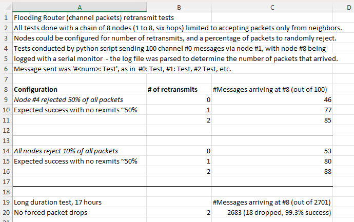

The negative impact of retries for channel packets is that when a packet reaches the end of a chain, the last node will always perform its scheduled retries because it will not hear any neighbors echoing its packet. This wastes some power and ties up the local airwaves for a few seconds, but we view that the extra reliability provided by retries is worth this cost.

End-to-end reliability drops and latency increases as the number of hops end-to-end increases. It serves us best to be conservative in relay node placement - one or two weak links in the chain can kill end-to-end reliability. With 99% node reliability and no retries, a chain of 10 hops gives us 90% end-to-end reliability (.99 exp 10 = .90). We should be able to achieve >95% reliability over long hop chains with conservative node placement and given that our base configuration uses two retries. However, even with retries, hop max length should be kept in high teens at most. Wired segments (see the RS485 section) can be used to increase reliability and decrease latency over a long hop chain.

## Direct Messages and Public/Private Keys

__UPDATE__:  This is a historical section on the problem of managing public/private keys in order to exchange direct messages.  This problem of managing public keys between radios is what caused us to abandon use of direct messages during mesh setup, and add the capability of enabling/disabling range test via broadcast channels. You can safely skip this section if you don't care about sending DMs between nodes.

For two nodes to be able to exchange Direct Messages (DMs), they must have exchanged public keys. This is done when a node 'discovers' another node. You can force this between two nodes by powering both off, then power back on - after about a minute they will discover each other. Over time, a radio will accumulate nodes that it knows (has their public keys) and can exchange DMs with. Sending DMs is critical for the Comms team placing radios - we use DMs to turn range test off/on remotely.

A problem occurs when radio firmware is upgraded - this can change the public key.  If radios A, B could previously exchange DMs, but radio A has its public key changed, then sending a DM from A to B will result in a `no channel` error. To correct this, you have to connect to radio A, delete node B, then connect to B and delete node A.  Power both off, then back on, and let them re-discover each other.  This is irritating and time consuming when it occurs during node placement in a cave.

The `configure_node_2.7.py` script has recently added a `retain-keys` option.  Anytime the script is used with a radio, the public/private key is added to a file named `keys.txt`.  If the `retain-keys` option is used, then the radio will have its public/private key restored from this file if the radio node id is in the file. Use of the `retain-keys` option is now standard for our operation. 

For a node to talk on a general channel, only the channel key is needed.

Here is a [youtube video](https://youtu.be/ZyLO-XVfxyo) of us fixing this problem between two radios during the Tumbling Rock Jan 23/2026 test (J. Moon filming B.Reese correcting the public key mismatch).


# Utility Software

The `utils` subdirectory has the following python scripts:

1. The `configurator/configure_node_2.7.py` is a script for writing settings to a radio using the `Meshtastic` CLI. It reads a YML file that contains the settings (see `cave_node.yml` for an example). It is critical that all radios be configured in the same way and this script streamlines the process. During script operation, the settings are read back from the radio after programming to verify that all settings were transferred correctly, and loops up to three times to complete the programming. We have noticed that a radio does not always get all of the setting on the first try (for unknown reasons) so the verification loop is necessary.  This script also writes an information file to the `infofiles` subdirectory so that a record of each radio that is programmed is saved. A recently added feature by Dane Evans is that the Private/Public key of the target radio is added to a `keys.txt` file indexed by node ID.  The `--retain-keys` option can be used during programming to restore Private/Public keys in the radio from the keys in this file. This is crucial for DM compatibility between radios, as the Public Key can be changed during a firmware upgrade, and the target radio will no longer be able to send DMs to other radios.  See the discussion on topic on Public/Private keys for more information.  Note- the `--retain-keys` option is no longer needed if broadcast channels are used for the `ADRT` commands for enabling/disabling range test.

2. The `gen_csv.py` is a utility that parses all of the files in the `infofiles` subdirectory and writes out a summary CSV file. The format of the CSV file is specified by a YML file, see the `node_csvspec.yml` file for an example. This gives you a handy summary of all the radios that have been programmed.

3. The `log_parse.py` file is a utility for parsing the radio serial log files to produce a summary of incoming/outgoing messages + timestamps. This utility was upgraded to handle the emoji hex encoding in the log output that was added in Flamingo 3.26 build.  This has been updated in March 2026 along with the `fw2.7.16` firmware to support emojis in the log output.  This utility is no longer needed if the Windows MeshApp is used at Incident Command as it logs all messages to a text file.


# Testing

The following presentation [Huntsville Grotto Presentation/July 7, 2005/Jamie Moon](./doc/25-07-02_HSV_Grotto_Program_FLAMINGO_Cave_Radios.pdf) contains a lot more details on the two Tumbling Rock tests and Guffey Cave test that are described below.

## Tumbling Rock Cave Preserve / Alabama /US   April 4, 2025

First deployment of radios with our firmware that had the modified packet header to support higher hop limits.  Deployed approximately 10 wireless radios in the cave and verified that we had a hop count greater than 7.   Reached the `handprint` wall'. 

## Tumbling Rock Cave Preserve / Alabama /US   June 6, 2025

Goals:

- Repeat previous test that reached the handprint wall using only wireless radios and use the new range test tool that prints out RSSI values to check node placement, RSSI values – `Accomplished`.

- Replace stub antennas with new longer, higher gain antennas, record RSSI values. `Accomplished`, new antennas are better, by about 5-10% in some cases.

- Test different radio modes to determine if giving up some distance for faster signaling is worth it. `Accomplished`, it is worth it, less latency, did not affect the chain reliability. We are now using Medium/Slow as our default radio setting.

- Deploy one more or more hard-linked RS485 paired radios (bridge nodes) to test a mixed wired/wireless system and push deeper into the cave. `Accomplished`, deployed one hard linked radio pair using a comm spool (about 700 ft), then deployed the last wireless radio after that and reached past the totem gallery. Total radio hops at this point were 11, there were 12 radios deployed.

After deploying the last radio, we still had two comm spools and a pair of bridge nodes, and could have pushed deeper, but it was about 20:30 at that point and everyone was burnt, so Jamie called it. Exited the cave at 21:30. The testing of the antennas and the radio modes took a long time as each radio had to be visited/handled to accomplish the task.

[Unedited Youtube Video](https://www.youtube.com/watch?v=4BVUCpGBc3U&ab_channel=Chris%27Corner) of the Tumbling Rock test.

## Guffey Cave / Alabama /US   June 27, 2025

Guffey Cave is the site of the all-day cave rescue scenario that is the capstone of Huntsville Cave Rescue Unit's four-day cave rescue class that is held each year in late July/early August.  We wanted to test deployment of the mesh in preparation for using it as an instructor channel during the scenario this year.

The goal was to reach `The Big Fall Room` which is about 1 km into the cave, and which generally students are able to reach with wired comms during the scenario.  We also wanted to test our new listener node that had an active buzzer installed that beeped based on RSSI value, useful during wireless node placement.

We exceeded the goal, we reached about 200m past the `The Big Fall Room` and to the crawl that leads to `Little India`. The total distance into the cave was about 1200m. 

 - Two wired segments were deployed (900 ft/275m from entrance to just before the pump room) and another wired segment (240m ft) that went through the breakdown leading to `Grand Central`.   There were wireless relay nodes between the two wired segments and after the second wired segment.  The wired segments were using 4800 baud as we thought that might have to connect all four spools together (1 km) but that proved unnecessary.  We could have used as high as 19200 baud since each bridge node was only driving one spool (~900 ft/275m).

 The team still had two comm spools (each 800 ft/240m) and a pair of bridge nodes when they reached the crawl to `Little India` but we were about out of time and had accomplished our goals.  The remaining time was spent replacing some of wired connection #2 with wireless nodes for experimentation purposes.

 Total deployed radios were 4 bridge (RS485/wireless) nodes, and about 12 wireless nodes.

 ## HCRU Cave Rescue Class Scenario/ Guffey Cave / Alabama /US   August 3, 2025 

For the Cave Rescue class scenario, we replicated the previous deployment. We also distributed radios (WisMesh Pockets) to several instructors that were in the cave. The total radio deployment was 20 - seven for instructors (and the IC radio) and the rest for the mesh (this includes the bridge nodes on the wired segments). One instructor had their own T-deck that was programmed with our firmware. The mesh performed flawlessly during the day-long exercise.  A total of 453 text messages were logged by IC (primary channel and DMs to IC) - this did not include DMs between instructors in the cave. The maximum hops logged was 11 - this was at the location of the two patients that were the most remote point of the scenario.

Since the two wired segments were relatively short, one about 300 feet and the other about 700 feet, the bridge nodes used 19200 baud.  LORA mode was Medium Slow for all radios.

The mesh proved its worth almost immediately when a mistake was made in the placement of two patients - this was discovered and fixed via text messages.  Throughout the day, dynamic adjustments were made to HCRU unit member placement in the cave via text message coordination over the mesh.

HCRU leadership was thrilled with the mesh performance and want to have mesh usage in future events.

## HCRU/Chattanooga Cave Rescue/Jackson County Rescue Mock/ Tumbling Rock Cave / Alabama /US   Sept 27, 2025

HCRU hosted a joint mock scenario with Chattanooga Cave Rescue/TN, Jackson County Rescue, and two members from Blacksburg Va Rescue Squad on Sept 27/2025 at Tumbling Rock cave preserve. About 50 cavers were in attendance.  The initial teams entered at about 9:00 am and the patient exited at 5:00 pm.  The scenario had two patients (one ambulatory and one requiring a litter) who were located in a vertical section about one kilometer into the cave. A mesh was established in the cave, using approximately 23 cave radios, three different wired segments (900 ft/800 ft/ 800 ft) using six bridge nodes, and 10 other mesh radios for rescuers. 

The Good:

- Comms was established to the patient location (which was 100 ft above the floor in a vertical section)
- Wired bridges worked very well
- The heartbeat LED added to the 2nd Gen cave node worked well for finding placed nodes during retrieval

The Bad:

- I was not conservative enough in initial placement of the wireless nodes, leading to comms failure to IC once we were about 5 or 6 wireless nodes past the first wired link.  Our two Blacksburg members (Philip B and Jerin M) went back to identify weak spots, and then eventually called for more mesh nodes which we sent back with a third member (after we had laid the second wired link). See the discussion below for the root cause of this problem.

- The comms shared channel was chaotic - we need to use a different shared channel for comms status/link status back to IC with the shared channel for general rescuers.

- Rescuer radios need to be placed on client mute while the mesh is being deployed/debugged as if you are trying to debug a weak link then other Client radios can mess up your debugging (Philip B suggested this initially and I ignored him, and regretted it later). Once the mesh is established with solid comms then rescuers could change to CLIENT mode.

- Need to give radios meaningful names (change the long name) as they are being handed out to rescuers in order to avoid questions like "Who is HA28" on the comms channel during rescue. This is a protocol change, easy to implement.

Overall, leadership of the squads agreed that the mesh radio usage was a success. A backup plan was in-place to use wired+field phones if the mesh failed to perform, but fortunately was not needed.

Below is a photo of all of the radios used in the mock -
the orange capped nodes are the 2nd gen cave mesh nodes, the nodes to the far left are the 2nd gen bridge nodes, the clunky squarish nodes in the middle are the prototype bridge nodes and pile in the middle are rescuer radios (WisMesh pockets and a Tdeck). We used 6 of the 8 available bridge nodes and still had two bridge nodes and a 750 ft wire spool when we reached the patient. FYI, Chris Cargal and Becky Williams designed/made the 3D-printed enclosures for the 2nd gen bridge nodes, while Jamie Moon designed/made the 3D-printed enclosures for the 2nd gen cave nodes.

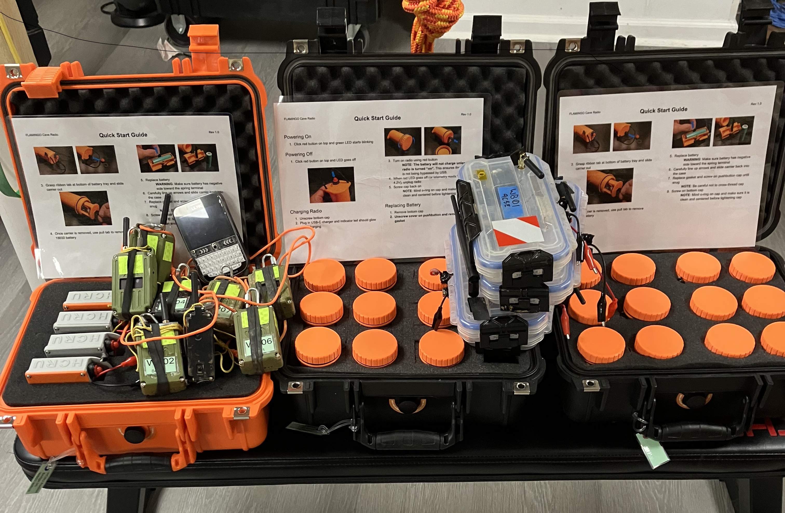

This  [map of node locations/Chris Cargal](./doc/TR_mock_Nodes_20250927.pdf) was made by Chris Cargal.  Node locations were recorded by Chris as we picked up radios as the patient was being carried out. Blue lines are the wired segments, red dots are wireless nodes. One of the red nodes after the end of the last wired segment is a rescuer radio 100 ft up from the cave floor at the patient location. The lengths of the wired spools used for the wired segments were (WB02-WB01/900 ft, WB01-WB02/800 ft, WB10-WB07/800ft).  Wired bridges used a 9600 baudrate; this was chosen conservatively in case we wanted to connect two spools together.

Photos of the 2nd Gen cave node and bridge node are below.

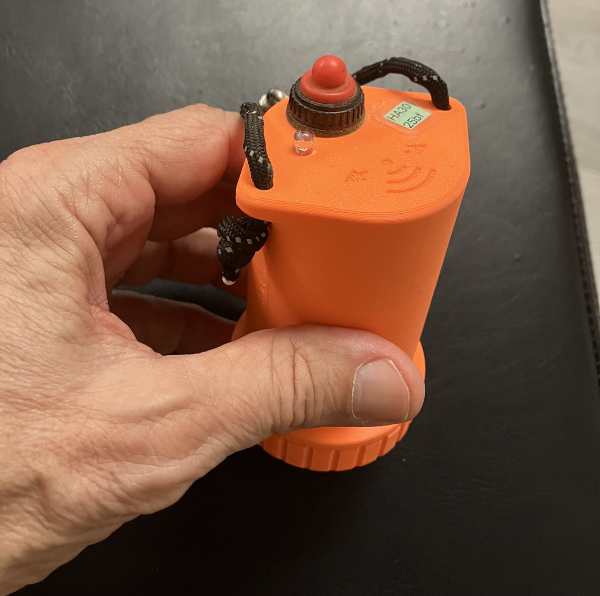

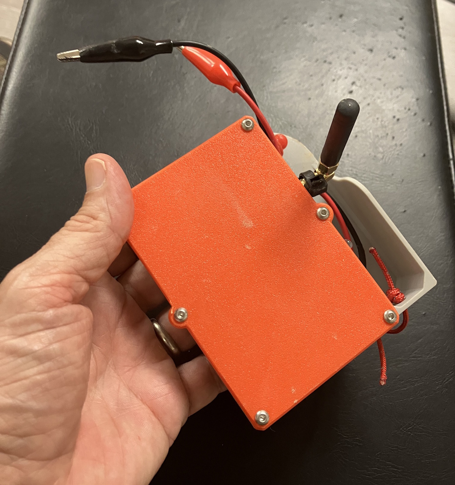

### So why did the mesh used in the Tumbling Rock Mock have initial reliablity problems?

The reason that the cave node placement in the Tumbling Rock mesh looks somewhat haphazard, is because after initial
node placement, there was unreliable comms back to IC, which had to be fixed by going back and patching up weak links
by placing more nodes.

Some extensive testing after the mock revealed the root cause. In our past tests in Tumbling Rock, the 1st gen cave nodes (external antenna) and WisMesh Pockets (external antenna) had similar range, and we used a Pocket as the listener node for placing the cave nodes.

For the mock, we just did the same thing - used a Pocket as a listener node to check the RSSi value of the range test packets being used to place the 2nd gen cave nodes (internal antenna).  However, extensive testing after the mock has revealed that the 2nd Gen cave nodes have about 25% less range than the pockets, due to the internal antenna config.  Thus, cave nodes were being placed out of their reliable range (essentially we were using an apple to place oranges).  The 2nd gen cave nodes were ready just-in-time for the mock, and basic functionality testing was done on them but not a lot of range testing.  It was just assumed that the 2nd gen cave node range would be the same as the 1st gen.

Anyway, lesson learned - __always use the same type of radio to listen for range test packets as the radios being used to build the mesh!__

Automated packet testing after the mock also showed the effect of SNR on packet loss - once SNR goes negative, it all over with - packet loss becomes unacceptable (RSSi can still be in the 'ok' range even if SNR is negative).  Currently the buzzer code only watches RSSi value but it is going to be modified to also be sensitive to SNR.

## Hop Latency/Range Testing - October 2025

After the September Tumbling Rock Mock, other than the initial wireless mesh reliability problems due to poor node mesh placement, we also noted:

- Message latency was very long - up to 2 minutes for a round trip to Incident Command and back. The long latency caused confusion/uncertainty between rescuers and IC.

- TraceRoute was unreliable for debugging problem points in the mesh

Because of these problems, extensive range and hop latency testing was performed. As noted earlier, we discovered that the 2nd generation cave nodes have about 25% less range than the WisMesh pockets, due to the internal antenna.

We noted from the message log from the Tumbling Rock mock that some of our messages had a hop count of 16 - so we set up a testing environment to record the latency of large hop counts. The photo below shows 19 cave nodes that were used to test a 17 hop latency for both broadcast messages and trace routes. The nodes were loaded with a version of the Flamingo firmware that used the magic number in the header to indicate what node forwarded a packet, and nodes only accepted packets from their immediate neighbors.

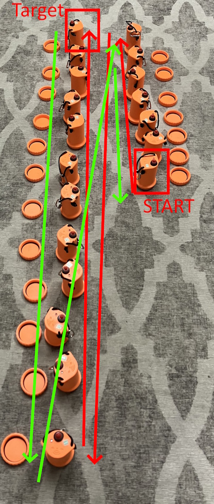

Data on hop latency over 17 hops is shown below. Note that for the MEDIUM/SLOW mode used in the mock, a minimum of 90 seconds round trip latency is expected (not counting the human reaction time to read a message and respond or extra delay due to collisions/retries).  A SHORT/FAST mode will have a round trip time of about a minute, which is more tolerable.

__UPDATE__: This date is obsolete as all nodes had `CLIENT` roles.  If the `ROUTER` role had been used, latency would have been much less. 

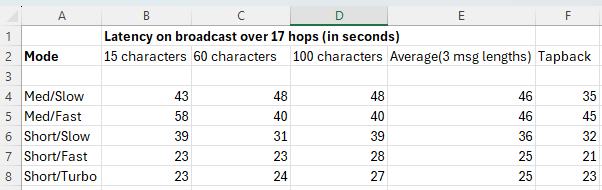

LORA Mode vs Range is shown below (distances are normalized to the the longest distance in a test). It was interesting that the internal antenna configuration of the 2nd Gen Cave nodes tended to reduce the range differences between modes.  The WisMesh pockets showed a greater range difference between modes, but not enough to rule out using SHORT/FAST as the default mode.  Also, the faster packet transmission time should reduce the number of packet collisions, reducing retries and thus reducing latency.

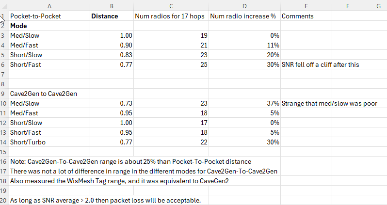

A TraceRoute will have a round trip time that is double the latency shown in the hop latency table, because the trace route packet has to reach the target and then return.  The Trace Route packet in the Flamingo 2.7 firmware was modified to support a maximum of 19 hops (trace route data for this fits in one packet) - 19 hops was tested and confirmed as working as shown in the photo below. The 2.5/2.6 Flamingo firmware versions only support 8 hops.

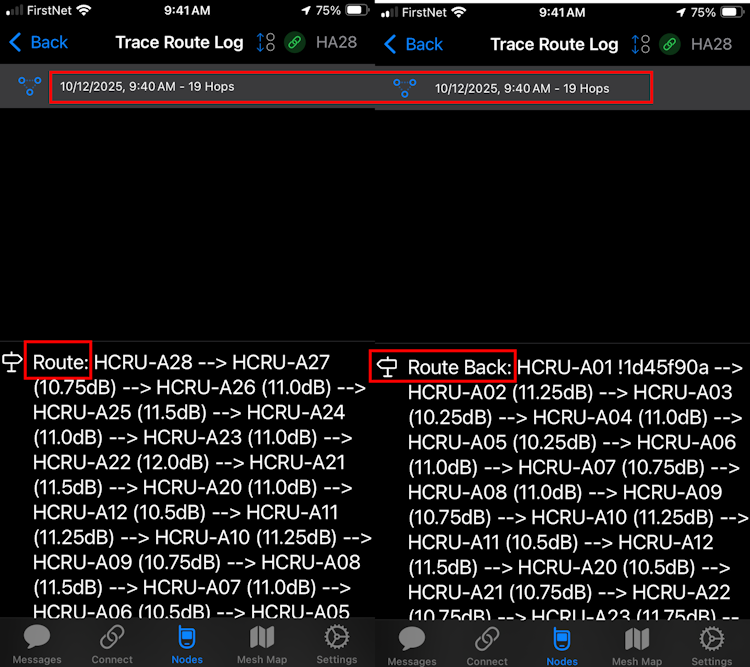

Testing of trace route during the hop latency tests indicated that the trace route was very unreliable over a large number of hops. In the 17-hop artificial environment, trace route could be 100% killed every time by starting a trace route at one end, and while the TR was in-flight, send a broadcast message from the other end of the chain (a sniffer node was used to watch packet progress). When the packets passed each other, the TR packet would die (blackhole) a couple of hops later. However, simultaneously starting broadcast packets at each end caused no problems, both broadcast packets would successfully transit the entire chain. Debugging revealed that a trace route packet is treated as a direct message, which means that it is handled by the `NextHopRouter` code instead of the simpler `FloodingRouter` code. The `NextHopRouter` code tries to be smarter about how/where to forward a packet but seemed to get confused in this long chain case in the presence of extra traffic. A simple change was made to the code to handle trace route packet forwarding in the same way as broadcast packets, with the `FloodingRouter`, and this fixed the reliability problems (this change is in the 2.7 Flamingo code). In the worst case, this just means that there are more trace route packets than necessary running around the mesh during an active trace route, the extra packets die off in a standard fashion just the same as broadcast packets.  This may not be the best fix but it works for us.

The end result of these changes is that in our next mock, comms between rescuers and Incident Command should be faster and more reliable. Trace Routes done by the Comm team to debug weak links should be much more reliable.

__UPDATE__: Trace Route has been very reliable since these changes and the change to using `ROUTER` mode for relay nodes.

## Traceroute/External Antenna on Cave Nodes Testing, December 2025

A trip was made to Tumbling Rock in December 2025 to test the fixes to trace route and to use second generation cave nodes that were converted to an external antenna configuration (the cave nodes used in the September mock had internal antennas). During node placement, we ensured that the same type of radio was used to listen for range test packets as those used to implement the relay chain during radio placement so as to avoid the mistakes made during the September mock. Seven radios were placed (no wired segments) using SNR as the placement criteria and SHORT/FAST as the LORA mode.  The placement went smoothly, and the chain functioned as expected. The new trace route code was tested, and it functioned as expected except for one case where the Android App log showed a repeated segment of the log (we will keep an eye on this going forward).

## Firmware 2.7.15 testing, January 2026

After updating the system to 2.7.15 and implementing an improved retransmission scheme, the original batch of TacMesh radios were taken out for an above-ground test. One hybrid radio (with antenna stowed) was planted and the remaining 7 TacMesh nodes were strung off of a trail near the C&O Canal in Washington, DC. All radios were set to minimum transmission power of 1dBm (~1mW) to reduce distance. Average spacing ended up around 160m per segment. Since this was a solo test, messages were only able to be sent one way but multiple Traceroutes returned successfully with seemingly lower latency than LONG_FAST or MEDIUM_SLOW modes. 

As an additional test, the final node was connected to a Raspberry Pi running the experimental "ez-callout" script. Although the Pi was not connected to WAN, the script successfully detected messages when the hybrid node was asked to run a hopping range test down the line.

A trip is scheduled to Tumbling Rock cave near the end of January to test the 2.7.15 firmware with retries implemented for channel packets.  The primary goal is to replicate the end point reached in the September mock (the Christmas tree).  We will use the same number of wired segments and whatever number of wireless nodes is required to meet that goal. We expect to place much fewer radios than the September mock and to complete the setup in half the time.

## Tumbling Rock Cave Preserve test, January 23/2026

We returned to Tumbling Rock Cave Preserve on January 23/2026 with the goal of reaching the Christmas Tree, which was where comms reached during the mock rescue of Sept 27/2025. HCRU members present were R. Filler (IC), T. Barthel (IC), B. Reese, J. Moon, J. Cole, and J. Farrar. We wanted to test 2.7.15 (wireless radios) and 2.7.16 (bridge nodes) firmware that had all of the recent improvements.

The goal was accomplished, we placed 15 radios (6 bridge nodes for three wired segments, 9 wireless only radios).  

This map shows the radio placement - this is much cleaner than the radio placement done for the Sept 27/2025 mock as all radios had external antennas for relays and listening, and we used an SNR above 3.0 for placement criteria and thus avoided any weak links.


The following is a timeline (credit: J. Cole) of the radio placement. Some issues with public key mismatches for the direct messaging used to turn packet test on/off slowed us down, and we were also taking video while we were progressing.

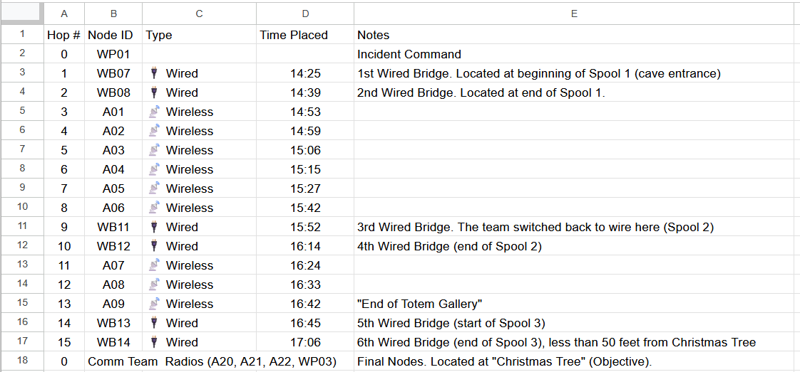

The comms were generally flawless during the test. We had to do some remote IT work for the two members at IC as the laptop used for logging decided to reboot for a Windows update.  Here is the  of the messages recorded at IC. The reboot happened between 15:29 and 15:41.  The log does not include outgoing tapbacks from the IC to the comms team to acknowledge messages.

Latency was about one minute over the 15 hop chain (LoRa mode SHORT/FAST). Below is a trace route (forward direction shown) sent from the Christmas tree.

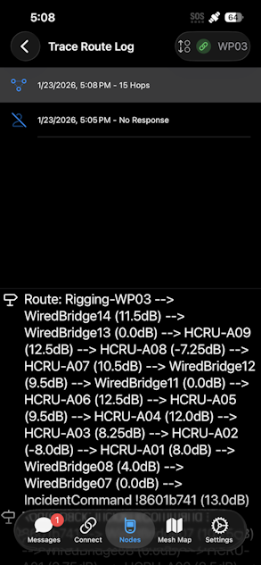

## Tumbling Rock Cave Preserve test, March 20/2026

A short test was done at Tumbling Rock on March 20, namely to test out a different frequency and re-test EZ-Callout

Four of the TacMesh radios had their cores swapped with EU-433 modules (RAK4631-L) and some foldable antennas from Amazon. They were programmed to have encryption disabled and broadcast Jamie's HAM radio technician callsign so as to be as FCC-compliant as reasonably possible. With the help of T. Barthel and B. Filler, B. Reese and Jamie laid a short wired segment into the cave and then placed 915/433MHz nodes in parallel. During range-testing on the first leg, it was quickly evident that the 915 radios had better signal for the exact same path. Thinking it was a faulty new unit, we tried both a different TacMesh unit and a different 433MHz antenna from the bunch. At the same spot that Bob's radio (904MHz) was getting an average SNR of 10dB, the 433MHz radios were getting around zero or -2dB SNR. Given this result, and the added inconvenience (and integration cost) of the new frequency, we concluded there was no significant advantage of 433 over 915 for our application.

On the surface, an extra node (set as CLIENT_MUTE) was connected to a Raspberry Pi 4 running the EZ-Callout script via USB. The Pi was connected to the HCRU StarLink system for satellite internet. This successfully listened to the FLAMINGO network traffic throughout the test. From several hops into the cave, we were able to send an automated callout message to Jamie's brother out-of-state. Once exiting the cave, we confirmed that he received the callout message via SMS within a minute of sending our message. This shows a promising result that could be useful for remote and/or expedition caving where no personnel are at the surface.

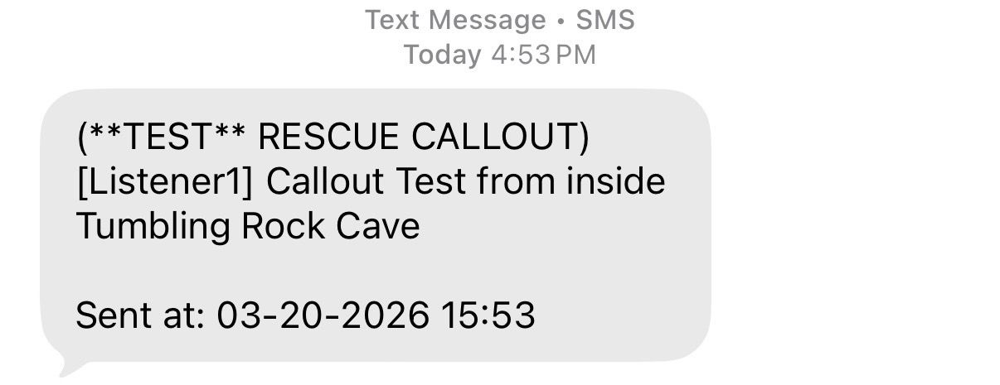

## HCRU Cave Rescue Class / Hughes Cave and Guffey Cave / Alabama /US --  August 1/2, 2026

This is a short summary of the radio usage in the HCRU August 2026 Cave Rescue class. The mesh radios were used Saturday/Aug 1 (training day) in Hughes cave and Sunday/Aug 2 (Mock rescue) in Guffey cave.  In Hughes, the base mesh was about 10 nodes (2 outside the cave, this was the IC radio and one relay node to the cave entrance). All nodes were wireless, there were no wired segments.  This was the first year we deployed in Hughes cave and Jamie placed nodes before the students entered -- setup only took about 45 minutes. The mesh topology split down two different passages and was not just a single chain.

In Guffey, we used the same mesh topology that was used last year -- two wired segments (from entrance to a 15ft ladder down - about 200 ft, then another wired segment through breakdown - about 500 feet), and about 8 other wireless nodes. Incident Command was located about 1/3 mile from the cave entrance which was down in a depression and the area was heavily forested, so two relay nodes were used to achieved a solid connection back to IC.  I handed out 19 rescuer radios (a mixture of WisMesh pockets, our CaveNode V2 wireless, and some extra Hybrid nodes that we had). In fact, I ran out of radios! I have discovered that EVERYONE wants a radio - I could have handed out about 3-4 more radios!   The Mesh ran basically flawlessly both days.   HCRU admin praised the mesh operation during the debrief to unit members and students at the end of the mock on Sunday.  Most of the rescuer radios were Client Mute (I sprinkled in a few CLIENT modes, about 3/4 were Client Mute).   All relay nodes were ROUTER mode. There were 31 students in the Mock and they used field phones as their comms; the mesh was for instructor usage.

Approximately 300 texts were exchanged during the Mock on Sunday. The firmware used was version 2.7.16.  A few rescuers reported some sporadic bluetooth disconnects that were solved by restarting the phone Meshtastic App and power cycling the radio.  We will investigate moving to the latest firmware version now that the Cave Rescue class is behind us.  The Windows desktop MeshApp (available in the Flamingo repo) was used at IC for monitoring/logging messages.  It worked fine but needs some tweaking - one need is that tapback support that is tied to a particular received message should be added.

HCRU now considers the mesh system proven/reliable and can be used in an actual rescue at the discretion of the Incident Commander.

## Tutorial Documents

The basic radio operation tutorial is for any user who will be using a Meshtatic radio for cave communications.

The remaining sections are for the person(s) who are responsible for configuring radios with new settings or updating radio firmware. The directions are written for someone using a Windows operating system. For a Linux operating system, you will need to visit the official Meshtastic documentation hub.

### A. Basic Radio Operation

This [PDF document](./doc/FLAMINGO_basic_radio_operation.pdf)
 describes how to install Meshtastic, pair to a radio to a phone, and send channel/direct messages. The app screenshots uses our old channel names.

### B. Installing the Python Command Line Interface for Meshtastic

This is a must-have capability if you plan to update radio firmware and/or settings.  
The python command line interface allows you to update radio firmware and settings from the command line, which is the method that we recommend. The follow on instructions for updating firmware or applying radio settings assume these steps have been followed.

These steps assume a Windows operating system. If you are running a Linux operating system, please look at the official [Meshtastic docs](https://meshtastic.org/docs/software/python/cli/installation/).

#### B.1 Install Python
1. Go to the [Windows Python downloads page](https://www.python.org/downloads/windows/) and download the installer for Python 3.14 or later.
2. Run the installer
 - Choose `Customize Installation`
 - On the next window labeled as `Optional Features`, leave anything already checked as checked and continue
 - On the next window labeled as `Advanced Options`, check the boxes that have `install for all users`, `precompile standard library`, `Add Python to environment variables`. In the `Customize install location` typein file, use `C:\Python314` (or whatever version you downloaded)
 - At this point, you can click the `Install` button to complete the installation.

#### B.2 Install the Python Meshtastic package

1. Open a command window (in the search bar at the bottom of the window, type`command` and then choose `Command Prompt`) - you may be able to just type `command` followed by enter.  This opens a command prompt window

2. Type `python` followed by the `enter` key (shorthand notation is `python<enter>`). You should get a welcome message from Python displaying the version, this simply verifies that you installed python correctly.  Exit Python by typing `exit()<enter>`.  If you get `python is not recognized as an internal or external command` then either Python was not installed correctly or it did not get placed on the system path variable, so revist the `Install Python` section.

2. In the command window, type `pip install meshtastic` (from now on `enter` is assumed typed after all command line prompts).  You will get a bunch of messages about `Collecting` various packages and the end result is that Meshtastic python interface will be installed.


#### B.3 Testing the Python Meshtastic package

1. Open a command window, and type `meshtastic --info` . You should get back information listing all of the supported command line options.  If you get `meshtastic is not recognized as an internal or external command` then the installion of the Python Meshtastic package failed in some way, revisit that section.

2. To program a radio with new firmware or settings, the radio must be on and plugged into your PC via a USB-cable (the radios have a USB-C port).

3. Connect a radio via a USB-C cable to your PC and turn the radio on.  In a command prompt window, type `mode`.  You should get back several lines of information - at least one line will have `Status for device COMxx`, where `COMxx` is the comm port number (i.e, COM21). The `COMxx` is only important if there was more than one of these as you will need to pass this parameter to the `meshtastic` program.  

- If there is only one `Status for device COMxx` line, proceed on, the `COMxx` value is not important.
- If there are no lines that contain `Status for device COMxx` when the radio is turned on and connected, it means your USB port is defective or the radio is defective.
- If there is more than one `Status for device COMxx` line, turn the radio off and execute `mode` again, to determine which `Status for device COMxx` line disappeared.  Record the `COMxx` value that appears when the radio is turned on.

4. Ensure the radio is turned on and connected to the PC via a USB-C cable.
- If there was only one `Status for device COMxx` line, type `meshtastic --info`
- If there were multiple `Status for device COMxx` lines, type `meshtastic --info --port COMxx`, i.e. `meshtastic --info --port COM21` , where the `COMxx` is the port corresponding to the connected radio.


If successful, the `meshtastic --info` command returns a lot of information about the internal settings of the radio, you can ignore this. The goal of being able to talk to the radio via the python meshtastic command line interface has been reached!

### C. Installing Git and Cloning the Flamingo Repo

Programming the radio with our setup utilities/configuration files or firmware files assume that the Flamingo repo files have been `cloned` to your local file system.

#### C.1 Git Installation
The `git` program is used to `clone` a repo (copy a repo) to the local filesystem.

1. To install `git` on Windows 10 or later, open a command prompt window and type `winget install --id Git.Git -e --source winget`.   This will install the `git` program.
2. To test, type `git --help` in a command prompt window and you should get back information on the command line flags for `git`.

#### C.2 Cloning the Flamingo Repo

To clone the repo, follow these steps (this uses the command prompt).
1.  Open a command prompt window and execute the following commands in sequence:
```
cd C:\
mkdir myrepos
cd myrepos
git clone https://github.com/rbreesems/flamingo.git
```

2. The above steps make a new folder (directory) named `C:\myrepos`, and then uses git to clone the Flamingo repo into that folder. The end result is that there will be a new folder named `C:\myrepos\flamingo` that contains all of the files from the Flamingo repo.

2. The advantage of cloning the Flamingo Github repo is that you can update your local files with our latest changes by executing the following in a command prompt window:
```
cd C:\myrepos\flamingo
git pull
```
2. The output of the `git pull` command will be `Already up to date.` if your local files match the remote files, or else there will be notifications of changed/new files being downloaded/updated.   You are probably used to phone Apps that automatically update themselves.  There is no automated update of the Github Flamingo repo files on your local filesystem unless you execute `git pull`. So, if you have not updated the repo in few weeks, always do a `git pull` to ensure that you have the latest files.

### D. Installing new firmware to a radio

Firmware is the program that is loaded into the radio and performs all of the radio functions. It is specific to the radio CPU and radio model - do not load new firmware unless you are certain the firmware file is compatible with the target radio. If you load incompatible firmware it may __BRICK__ the radio and render it unusable. 

Before you do this, ensure that you have read the secion on [Pre-Built Firmware files](#pre-built-firmware-files) and know what firmware file you wish to upload into a radio.

First, when do you need to update firmware?  If your phone IOS/Android apps are playing well with the current radio firmware, then there is no need to update. However, if a user complains that their phone App updated and can no longer talk to a radio, then this may indicate the need for a firware update.  The Meshtastic IOS/Android apps are constantly updated in order to stay abreast of IOS/Android operating system updates.  The Meshtastic firmware itself is constantly being tweaked to add new features/bug fixes, of which 99% are not really necessary for run-of-the-mill communication.  So, updates like going from `2.7.25` to `2.7.26`, would not be needed.  However, a update like going from `2.7.xx` to `2.8.xx` may require radio firmware to be updated to `2.8.xx` to stay compatible with phone Apps. If your firmware is currently at `2.7.xx` and the latest meshtastic firmware is at `3.y.xx` (a major version change) then this almost surely means that you need to update your firmware.

Whoever is responsible for maintaining the unit radios should check every 1-3 months that IOS/Android apps can still talk to the radios.  You can also check the Flamingo repo readme for the firmware that we are currently using to determine if you need to update.

This section uses the Python Meshtastic command line interface to install firmware. The official Meshtastic docs will point you to a web-based firmware flasher - do not use this as it is not as flexible as the command line (and I am not sure how well it would work offline or with our firmware files).

To update the firmware on a radio, follow these steps:

1. Ensure the radio is turned on and plugged into the PC via a USB-C cable, and that `meshtastic --info` typed in a command prompt returns radio information.
2. Open an Explorer window to the folder that contains the `.uf2` firmware file that you wish to update (like in the screenshot below):


3.  Enter the command `meshtastic --enter-dfu` in the command prompt window. This will pop-up the UF2 upload window as shown in the screenshot below. There will also be some INFO/WARNINGs printed in the command prompt window, ignore these.


4. In the Firmware directory window, left click on the firmware file to use to select it, then right-click and select `Copy` from the pop-up menu.

5. Move the mouse to the `Firmware Upload Window`, left click to select it, and then right-click and choose `Paste` to paste the copied firmware to the radio. At this point you may get a progress bar that shows programming that closes when programming is complete. You may also get an error window pop-up as shown below. If this happens, select `skip` and the progress bar will appear and programming will complete.


6. To check if the firmware was uploaded, type `meshtastic --info` and look at first few lines as shown in the screenshot below. The firwmare version should have a name that matchs the version number (in this case `2.7.25`) and the Git commit value (in this case `9e7fbf63`) that appear in the firmware file name.


### E. Configuring Radio settings

#### E1. The configure_node_2_7.py script

You can configure radio settings from the phone app, but this is slow and error-prone. There are a few cases where you may want to use a phone app to configure a setting, like the radio long name or to change a radio device role (like from ROUTER to CLIENT).

This [link https://meshtastic.org/docs/configuration/radio/](https://meshtastic.org/docs/configuration/radio/) describes the dozens of configuration settings that are available and how they can programmed using the Meshtastic command line interface. Fortunately, you don't need to know/understand all of these settings - we have identified 22 settings that we use in our configuration file and leave the rest at their default values.

It is important that all of your radios share the same settings for things like LORA mode and Channel configuration so that they can talk with each other.

To make it quicker and less error prone to configure radios, there is a `utils/configurator/configure_node_2.7.py` Python script that can be used with a `.yml` file that contains configuration settings (see [utils/configurator/configs/HCRU/cave_node_aug26_router.yml](./utils/configurator/configs/HCRU/cave_node_aug26_router.yml) for an example).  This contains all of the settings we want to program for any radios that we want to use the `ROUTER` device role. The file [utils/configurator/configs/HCRU/cave_node_aug26_client.yml](./utils/configurator/configs/HCRU/cave_node_aug26_client.yml) is the same as the previous file except that it has a `DEVICE_ROLE` of `CLIENT` and the `range_test` setting is disabled (this radio will not see range test packets)

See the screenshot below for an example execution of this configuration python script - in this example, the script is executed from the `./utils/configurator` directory because I want the `infofiles` directory that is created as side-effect to be in this directory.


The `configure_node_2.7.py` requires the first argument to be the name of the settings file.  The `--set` option says to program the radio with these settings.  If you did not include the `--set` it would just compare the radio settings and tell you what is different.

When programming the options, the current radio settings are first read and compared against the settings file.  Only settings that need to be changed are then written to the radio. The same is done for channels. After programming, the radio settings are read again and checked to ensure they were written correctly - if not, then another programming round is done.  After a second check, if there is still a settings mis-match an error is printed and programming is stopped.

At the end, once the settings have been programmed, a sub-folder named `infofiles` is created and the settings for this radio is written out, with the file name being the short name.  This will be useful later on when trying to examine all the radio settings for the radios in the `infofiles` directory.

#### E2. Creating a spreadsheet of all radio settings with gen_csv.py

Perhaps you have just updated the firmware for all 20 unit radios, and now you want to check if you missed anything.
You can create an Excel .csv file named `nodes.csv` that contains a summary of the settings found for all radios in the `infofiles` directory by executing the following in a command prompt window from the `flamingo\utils\configurator` directory:

```
python ..\gen_csv.py ..\node_csvspec.yml
```

A screenshot of a part of the generated `nodes.csv` for our radios is below - I recently did this for our 30+ radios and I wanted to ensure two things: that the firmware version matched and the channels matched as this is what changed -- the other settings had been stable for several configuration iterations.


The first argument to the `gen_csv.py` is a YML file that describes how settings are mapped to spreadsheet column headers - you can look at the details of this file and script if you want to make changes.


