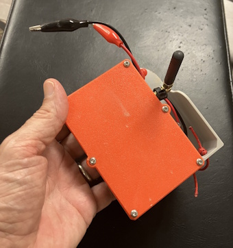

# Flamingo
Repo for sharing utilities for in-cave communication project using Meshtastic-based radios.  This is an extension of (but not affiliated with) the work done by the [Vangelis](https://github.com/semper-ad-fundum/vangelis) project.

With tongue-in-cheek, if flamingo must stand for something, then:

`FLAMINGO` - Forward Link And Mesh Interconnect Network Ground Operations !!!!! 

AKA -> Using Meshtastic radios for underground (cave) communication

# Summary
The goal of Flamingo is to provide a reliable cave communication system that is:
- Versatile
- Affordable
- Efficient

Building off of the wealth of knowledge within Meshtastic, Flamingo is optimized for a cave (i.e. chain) topology while maintaining the ease and flexibility of the self-organizing mesh. Our hybrid nodes allow users to run wireless or wired communications to suit their needs or to better accommodate complex cave terrain. 

One of our top priorities is keeping the radios cheap to allow this technology to get into the hands of rescue organizations or exploration teams. We can currently produce radios for about 50 USD each and well under 700 USD for a field kit.

Ongoing testing has shown that Flamingo can be set up more quickly than existing military phone communication systems and we are continuing to get that time lower and improve network strength.

If you are new to radios or Meshtastic, take a look at the specs below, otherwise jump ahead for a deeper dive on what we've been doing.

## Overview
- Allows sending and receiving text messages from deep within cave among teammembers and out to Incident Command
- Direct message or use dedicated private channels
  - Any technician with smartphone can connect easily
  - All messages are AES128 encrypted
- Faster deployment and cleanup compared to wire and phones
  - Cover up to 2,000ft of comms in 1hr of setup time using RF only
  - Cover over 5,000ft (1.6km) of comms per section of phone wire
- Seamlessly compatible with existing comms wire (hybrid nodes)
  - Hybrid nodes can be daisy-chained along wire
- Virtually unlimited chain length (up to 255 nodes)

## Operability
- Works with Android or iPhone using free Meshtastic application
- Self-organizing mesh network optimized for long chains
  - No special configuration needed
- Utilizes modified Meshtastic software
  - Supported by community developers
- Utilizes swappable 18650 Li-ion batteries
- Compatible with CalTopo and ATAK

## Current Kit Specifications
- Battery life:
  - Estimated 10+ days per charge
- Range (Radio):
  - 130-320ft (40-100m) between nodes
- Range (Wired):
  - Over 5,000ft of comms wire between nodes
- Ingress:
  - Water resistant (estimated IP55 for Cavenode V2)
- Weight/Volume:
  - <6oz (160g) per radio
  - <8lbs per field kit
  - 12 Cavenodes or 8+ Hybrid nodes fit in 10L hard case

# Project Background

We are members of the Huntsville Cave Rescue Unit [HCRU](https://www.hcru.org/) and one of our members (J. Moon) saw the Vangelis work and thought this could be useful in a cave rescue situation.  We use wired comms for cave rescues, but the problem is that the decades-old field phones that are used have no readily-available replacements, so a more modern approach is needed.  Dane Evans, New South Wales Cave Rescue (Australia) and regular Meshtastic firmware/Android app contributor, is also working with us. 

After looking at the Vangelis work, J. Moon recruited some tech-minded folks from the unit, and we started working.  The [Vangelis](https://github.com/semper-ad-fundum/vangelis) site gives a good summary of their attempt at using Meshtastic radios in a cave, and we used their tips on how to configure radios and what to expect when radios are placed in a cave.

A cave environment is much different from open air, with radios needing to be placed within near LOS of each other to form a linear chain (not a mesh) that forwards packets to/from the surface.   One of the challenges is the max hop limit of 7 that is in the current Meshtastic firmware - this limit is because two 3-bit fields (`hop_limit` and `hop_start`) are used in the packet header to track hops. The `hop_limit` is set to the max hop limit configuration setting.  The `hop_start` field is the max hop limit that the packet started with, and is decremented each time the packet is forwarded. The difference between `hop_limit` and `hop_start` is the number of hops the packet has traveled.  When `hop_start` reaches 0, the packet is no longer forwarded.

Meshtastic guidance is that 3 is typically a sufficient value for maximum hops for most mesh mesh configurations to avoid packet congestion. However, our configuration is a linear chain, so mesh congestion is not an issue. We require more hops than 7, with the max feasible limit something to be discovered through testing.

# Firmware Modifications

This [repo](https://github.com/rbreesems/firmware) is our fork of the meshtastic repo.   We have been using RAK4630-based radios, both built-from-scratch with 3D printed enclosures and off-the-shelf 
[WisMeshPocket V2](https://store.rokland.com/products/wismesh-pocket).  Dane Evans has a [Flamingo Repo](https://github.com/DaneEvans/Flamingo-Firmware) that has the Flamingo firmware changes and checks integration into the Meshtastic main firmware branch as it progresses, to ensure that we can stay abreast of Meshtastic development and are not tied to a single Meshtastic release (the `flamingo` branch in that repo has our changes integrated into the latest Meshtastic `main` ).

In the rbreesems repo, the branches `may2025` (firmware 2.5),  `hopmod_2.6.11` (firmware 2.6), `hopmod_2.7.9` (firmware 2.7.9), `hopmod_2.7.15`, `hopmod_2.7.16`,  contains our modifications (other branches should not be used).  The following summarizes our changes:

- Packet header has been changed to support a hop limit up to 255, but firmware has it limited to 31.
See the section on hop limit modification for a discussion of this change. The most important ramification is that radios with this firmware can only talk to radios with the same firmware.

- LCD splash screen displays Flamingo firmware version name.

- Range test has been modified to support non-hopping/hopping range test packets.  Default is non-hopping.  It has also been modified to be enabled even when GPS code is excluded. Also, range test data is never saved to storage.

- Range test messages sent to phone now have the RX RSSI/SNR for the received packet. RSSI is a negative number that increases in absolute value with increasing distance between TX/RX nodes.
SNR (Signal to Noise ratio) is a magic number sent by the Gods and you can figure out its relationship to distance. Actually, we have found that SNR is the best indicator (> 3.0 dB) of packets being received reliably for long hop chains.

- Range test should be enabled on all cave nodes as any cave node may have to send/receive range test packets. Range test must enabled and the sender delay must be set in order for the remote range test admin commands to work (set this via the CLI or app). Even if sender delay is non-zero, the sending action must be soft-enabled by an admin command as specified in the next bullet.

- Admin commands are supported for direct channel messages to a node. Admin commands are case insensitive (capitalization shown for emphasis only).  Admin commands are ignored if received on the general channel.
These admin commands are compatible with voice recognition in the messaging app. The first word of an admin
command was chosen to not be part of a normal status message.

  - `ADRT on`  -- turn on range test (default delay is 30 seconds)
  - `ADRT on hop`  -- turn on range test, and enable packet hopping
  - `ADRT off`  -- turn off range test.
  - `ADRT delay <15|30|60>`  -- set delay for between packets. Only 15, 30, or 60 is recognized.

- Logging messages to the serial port have been modified for easier parsing. Logging of all communication at Incident Command (IC) during a rescue is of critical importance. Our assumption is that the relay chain extends all the way to IC, with a laptop hooked to the surface node so that serial logging can be done.  The messages output to the serial port during operation were slightly modified so that they could be easily parsed afterwards, and incoming/outgoing messages with timestamps easily summarized. We use Microsoft Code + Serial Monitor plugin for serial monitoring. We used this methodology during testing and it worked well. There is a fix for logging of long messages in `HCRU 07/25.2` - a problem was discovered during the mock scenario held on August 3/2025 that messages longer than about 50 characters got truncated in the log. Fortunately, most of the messages during the mock were short, but it was still annoying to have lost some message content.

- Support for serial link via the RAK5802 RS485 module - see the detailed section below.

- Support for a buzzer haptic for RSSI - see the detailed section below.

- Support for a heartbeat LED (blinks every two seconds) - useful for locating nodes that have been placed in the cave. NOT SUPPORTED ON BRIDGE NODES (nodes with the RS485 interface).

- The  `hopmod_2.7.9` branch has some additional changes - SNR average is printed out in the range test packets, buzzer will have 3 beeps if SNR average is less than 1.0, and TraceRoute support has been extended to 19 hops and made more reliable (see the detail section on hop latency testing/TraceRoute).  In the other branches, TraceRoute returns inaccurate results past 8 hops.

- The `hopmod_2.7.15`, `hopmod_2.7.16` branches have additional changes over `hopmod_2.7.9`. These changes added retries for channel messages (configured for two retransmits on failure, stock firmware has none), and retries direct messages even if there is no known neighbor (stock firmware only retries if there is a known neighbor). See the section that discusses retry behavior for the rationale for these changes. The SNR threshold for three beeps on rangetest packets was changed from 1.0 to 3.0. There is also a critical update to the RS485 serial link code that adds a TX queue and improved RX handling, see the section on RS485 collision testing. If you use the RS485 link, then you should use `hopmod_2.7.15` or higher.

The `firmware/variants/rak4631/platformio.ini` file (2.6 or less) contains different targets for these various capabilities. All targets contain the hop limit and admin command modifications.

1. `env:rak4631` - just contains hop limit/admin modifications
2. `env:rak4631_slink` - `env:rak4631` + enables serial link modifications
3. `env:rak4631_buzzer` - `env:rak4631` + enables buzzer modifications
4. `env:rak4631_cavenode` - `env:rak4631` + enables buzzer modifications + blinky heartbeat led
5. `env:rak4631_slink_hb` - `env:rak4631` + enables serial link modifications + blinky heartbeat led (DO NOT USE - SEE BELOW)

The above targets are based on the `may2025` (2.5 firmware) and `hopmod_2.6.11` (2.6 firmware) branches.

The `firmware/variants/rak4631/platformio.ini` file in the `hopmod_2.7.9` and `hopmod_2.7.15` branches (2.7 firmware) has the following targets (in these branches, all Flamingo code changes are protected by a `#ifdef FLAMINGO`/`#endif` section).

1. `env:rak4631` - this target compiles to standard Meshtastic firmware
2. `env:rak4631_flamingo` - has `-D FLAMINGO` compile flag, just contains hop limit/admin/trace route modifications, suitable for a generic rak4631 device like a WisMesh Pocket
3. `env:rak4631_slink` - `env:rak4631_flamingo` + enables serial link modifications
4. `env:rak4631_buzzer` - `env:rak4631_flamingo` + enables buzzer modifications - assumes active buzzer.
5. `env:rak4631_cavegen2` - `env:rak4631_flamingo` + enables buzzer modifications + blinky heartbeat led, intended for our 2nd gen cave node

For targets that support the buzzer and heartbeat LED the pin usage can be changed via compile time defines.

The `firmware/tested` directory for pre-built firmware, in sub-directories labeled as `fw2_5`, `fw2_6`, and `fw2_7`.  Going forward, new features will be added to 2.7 firmware builds and will not be backported to 2.5/2.6.  The `firmware/beta` directory has firmware that is the process of being tested, but not fully vetted inside of a cave. As of January 2026, the 2.7.15 firmware updates reside in the `firmware/beta` directory, and all `2.7.15` firmware files are configured for two retransmits.

On the Bridge Nodes, aka serial link nodes (RAK19007 Wisblock base board + RAK4631 module + RAK5802 RS485 module) we have discovered that IO1 and IO2 appear to be shorted to each other on the RAK5802 RS485 board.  According to the RAK5802 documentation, IO1 is a low-true signal used to disable the RS485 interface, so our code always keeps it in the high state (we never disable the RS485 interface). We tried using IO2 for the blink LED, but found that RS485 operation became erratic with blink enabled. We then discovered that IO2 was always high, the same state as IO1, and it is suspicious that IO1 and IO2 are directly across from each other on the RAK19007 I/O connector. The conclusion is that IO1 and IO2 are shorted, and that blinking IO2 periodically enables/disables the RS485 interface, causing erratic operation. Unfortunately, there is no other easily accessible general purpose IO pin for use as the blinky LED using the RAK19007 base board. So on our bridge node builds, we just tie the blink LED to IO2 and accept that it will always be on when power is applied (does not appear to affect power usage that much, only a 7% overnight drop on an 18650 battery). So, our serial link firmware builds do not include the blink module for this reason.

## What LORA speed mode to use for cave nodes?

In our cave testing, we used MEDIUM/SLOW for our mocks/testing through October 2025. However, after the September Tumbling Rock cave rescue mock, we did some detailed hop latency/range testing (see the dedicated section on this). This resulted in a decision to use SHORT/FAST going forward in order to reduce latency over a large number of hops and to keep TX contention low. The distance that wireless nodes can practically reach in a cave means that the range difference between MEDIUM and SHORT modes is not that significant, and that we would rather have lower latency/less contention.  Wired segments with bridge nodes can be used to cover long distances with wireless nodes used to bridge gaps or reach vertically if needed.

## Buzzer Haptic for RSSI

The buzzer modifications use an active buzzer to indicate different RSSI ranges when a range test packet is received. The ranges are:

1. One beep: RSSI greater than or equal to -90
2. Two beeps:  RSSI less than -90  greater than or equal to -110
3. Three beeps  RSSI less than -110.

The 2.7+ firmware builds have extended this to also use a running SNR (signal-to-noise ratio) average based on the last three packets - if the average SNR falls below a set threshold, then three beeps is used regardless of RSSI. We have found SNR to be a good predictor packet loss. SNR tends to bounce around when moving so once beeps are sounded based on SNR, need to pause and wait for SNR to steady out to determine if SNR is unacceptable or not. The `hopmod_2.7.9` branch uses a value of 1.0 for the SNR threshold, while the `hopmod_2.7.15` branch uses a value of 3.0 (after more testing, we felt that a higher threshold was needed).

This buzzer is used during relay placement so that you don't have to keep your eyes on the screen to see RSSI values for range test packets. This does not use the RAK PWM buzzer settings in the phone app.  The buzzer is only installed on the radio that you want to use as a relay placement listener.

The buzzer we used was purchased from Amazon (search for Active Buzzer Module, 5V Piezoelectric Alarm, DIYables store) - it is a small 3-pin (Vcc/Gnd/IO) breadboard.  We have stuffed it successfully into a WisMesh Pocket radio, it just barely fits. It runs fine on 3.3V.  This particular active buzzer is an active low enable.

These modifications could easily be modified to support a passive buzzer.

## RS485 Serial link modification

The `slink` targets in the `platformio.ini` enable the serial link code. This code is meant for a RAK19007 Wisblock base board + RAK4631 module + RAK5802 RS485 module (installed in the IO slot of the Wisblock base board). This firmware modification sends/receives packets out the RS485 port in addition to the LORA link. This is intended to be used to hard link a pair of radios in a cave where wireless between the two radios is impractical.  The 
RAK5802 RS485 module uses the RXD1, TXD1 ports, so do not use this software with a board that has something connected to these ports, like the WisMesh Pocket radio that has a built-in GPS connected to this port. 

Our terminology for radio that has the RS485 interface is `bridge node`, as it allows bridging between the wireless/wired worlds.

Baud rate vs range testing yielded:

  - 115200 can drive 100 ft
  - 57600 can drive 700 ft
  - 19200 can drive 1400 ft
  - 9600 can drive 2400 ft 
  - 4800 can drive 4700 ft (1.4 km) 
  - 2400 can drive 5500 ft (1.6 km, do not know max distance,  suspect it is approximately 3 km - 9800 ft )

Any packet received over RS485 RX is echoed over LORA TX; a packet received over RS485 RX is delivered to the firmware stack in the same manner as a packet received by LORA RX. Any packet received over LORA RX that is rebroadcast by the router is also sent over RS485 TX.  Packet flow on the RS485 serial link is bidirectional, but does not support full duplex (simulataneous TX and RX).

Our procedure for testing if the hard link works between a pair of radios is as follows. This test assumes that the 
only two radios in range are the two hard linked radios that are being tested.
Connect two radios via the hard link, then bluetooth connect to each radio with the phone app, and in the Lora Config section, turn off 'Transmit enabled'.  Then send a direct message to whatever radio is not connected to via phone; if an ack is returned then the message went through the hard link to the destination.  Then, disconnect one of the wires in the hard link, and try sending again - this time the message send will fail with a max retry limit reached as the hard link is not connected.  Connect to each radio again via the phone app, and turn RF transmit back on.  Try sending the direct message again and this time it will succeed even with the hard link broken, as the message will go over RF.

To test RF RX (radio 1)> RS485 TX (radio 1) > RS485 RX (radio 2) > RF TX (radio 2) > RF RX (radio 3), just turn on a third radio in the room, connect your phone to the bridge node that has LORA TX disabled (radio 1), and target radio 3 with a direct message.  The packet will be sent by radio 1 over the wire to the bridge node with LORA TX enabled (radio 2), and which will then send the packet to radio 3 via RF -  you should receive an ACK back from this direct message.

The image below:  shows three bridge nodes @4800 baud and 1 km of wire (spools of 800/800/800/900 ft = 3300 ft). Two bridge nodes are the ends, and a third bridge nodes is spliced in the middle (like a field phone).  You could also place two more bridge nodes in this system, one each spool connection. The bridge nodes have their LORA TX disabled during testing, this forces packets over the wire.  This shows the power of the RS485 link - you can have as little or as much wire in the system vs wireless as you want.  These bridge nodes are packaged in temporary housing until our 3D printed enclosures are ready.  While this may look like a 'multi-hop wire' connection it is not - this just a multi-driver RS485 topology (which RS485 supports). Any packet sent by a bridge node over the wire arrives at all connected bridge nodes and counts as one hop. Just think of the wire as being 'air' if that helps.  There will be packet collision on the wire, just like there is packet collision over the air - there is no arbitration mechanism for who is allowed access to the wire. RS485 supports driver contention without damage to the drivers, the packets just get garbled and retries/random backoff are necessary to get packets through (just like via air TX).  It is assumed that cave rescuers will have individual radios with them, and if a rescuer is in range of a bridge node, packets from the rescuer will jump on the wire, and packets arriving at the bridge node will be sent over the air and arrive at the rescuer radio.

## RS485 Connection

RS485 is a two-wire differential bidirectional signaling protocol that can support multiple drivers, with driver contention (collision)
causing no damage to the drivers. For the RAK5802 RS485 module, if we call the two wires A and B, then A must be connected
to A and B must be connected to B.  This is because of how the RAK5802 is designed; it does not support cross-connected wires.  Traditional comm wire using field phones is connection agnostic, but that is not the
case with this system - reversing the connection A > B and B > A will cause a comm failure.  Because of this, we have marked the
ends of our comm wire with Red/Blue tape, and the connectors on the radio are Red/Black - so Red is connected to the Red terminal, and whatever color is not Red is connected to the black terminal. 

One strength of the traditional comm wire + field phones deployment is that the comm wire can be tapped into at any
point with a field phone.  That can still work with this system, but the problem is that typical comm wire uses black
for both wires, so there is no distinguishing A from B when tapping in.  The solution is to tap in using one polarity and send a direct message - if an ack is received, then the message succeeded and the polarity is correct. If no ack is received, reverse the direction and try again - it should succeed.  Having a reversed direction will cause no damage to
the RAK5802 RS485 module.

## RS485 Collision/Need for a TX queue

Just like over-the-air packets, there can be a packet collision if both ends of the hard link attempt to send a packet
at the same time. RS485 supports multiple-driver connection, and driver contention causes no physical damage.
However, the packet will be garbled on reception - the firmware uses a 16-bit header and a 32-bit CRC wrapper around each Meshtastic packet
sent over the RS485 link, so a garbled packet is detected and discarded.  If we assume an average text message is about 50 chars or less (so packet size is about 100 bytes with header bytes), it will take about 0.05 seconds to transmit at 19200 bits/second.  This gives 20 TX slots in one second for a packet.  If we assume a packet every 15 seconds, this is 300 TX slots, giving a collision probability of less than 1%.  IF there is a collision, the packet is lost. 

Prior to branch `hopmod_2.7.15`, no attempt was made to avoid RS485 collisions. However, the `hopmod_2.7.15` (an later) has two critical improvements to the RS485 serial code:
 - the RX code was changed to not read the UART input buffer until it was quiescent (no new bytes) for at least one serial module polling period (50 ms) to avoid reading a partial packet.
 - the TX code was changed to only send a packet if the UART input buffer was quiescent/empty to avoid corrupting an incoming packet. If the TX packet could not be sent immediately, it was added to the TX queue and then sent at the next polling opportunity whe the UART input buffer was quiescent/empty. The TX queue has a max size of 8 packets.

The image below:

shows the test setup for measuring the effectiveness of the above changes. Four bridge nodes were tied to the same RS485 pair, with three nodes sending channel messages at 20 second intervals using the Python Meshtastic CLI. The fourth node (monitor node) was logged, with the log parsed after the test completed to check how many of the channel messages the fourth node received.  All nodes has their LORA TX disabled, the only possible communication was via the RS485 link. The baud rate was 9600 baud. The goal was to create enough traffic on the RS485 link to force collisions if no RX busy checking was done.

The results are shown below:

 .

The base test was each node sending 100 channel messages for a total of 300 messages.  `Without TX queue` and `With TX queue` showed similar success rates of 98% messages delivered as measured by the messages received by the monitor node. However, `Without TX queue` and `With TX queue` had dramatically different total packets required as seen by the monitor node. The `Without TX queue` discarded over 50% of its RX packets due to a bad CRC check while the `With TX queue` case only discarded about 10% of its packets. The  `Without TX queue` had a high message success rate due to retries getting the messages through. Clearly the RX/TX changes in the `hopmod_2.7.15` branch make a significant difference in the number of packets required to successfully deliver a set of messages in moderate to heavy traffic.  The most packets seen in the TX queue for the `With TX queue`  case was 3, and this was only one time, the most common case was 1, with occassionally 2 packets.  

A seperate test was done with direct messages to investigate the root cause of `failed CRC on RX`. A test was made with only two nodes on the RS485 wire, with a Direct Message sent from one node to the other, with no chance of collison. The sender node occassionaly had a `failed CRC on RX error` immediately after transmitting a packet.  The best guess is noise on the UART RX input during RS485 TX, even though the RS485 board has a pullup on the UART RX to avoid this.  This noise is harmless in that the errant bytes are discarded at the next polling period after the TX, but it does mask true CRC errors due to collision and causes extra processing by the serial module.

## Hop Limit Extension

The packet header was modified to provide 8-bit fields for both `hop_limit` and `hop_start`.  This means an upper limit of 255 hops, but our firmware has set the maxium limit to 31 hops as probably this is the maxinum number of radios any sane individual would want to bring into a cave (however, this is easily changed to a higher number up to 255 if desired)

The packet header was extended by four bytes (must be aligned on a four-byte boundary) with one byte each for `hop_limit` and `hop_start` and the other two bytes for a 16-bit magic number used to identify our packets. 

Modifying the packet header structure has the following ramifications:

1. Our radios can only talk with each other, they cannot talk to any radios using normal Meshtastic firmware.
2. A normal Meshtatic packet arriving at one of our radios is rejected upon receipt after header parsing because of a magic number mismatch. There is a 1/66536 chance (~ 0.002%) that the magic number will be correct, but the packet will be rejected after further parsing due to structure mismatch.
3. Our packet header is constructed such that the original `hop_limit` and `hop_start` fields will have values of 1 and 0, respectively, so this packet will not be forwarded after the header is parsed.  Unpacking this packet will fail due to fields mismatch and so will be rejected.

There were enough extra bytes in the original Meshtastic packet structure that the 200-byte payload limit was not affected by the packet header modification.

Setting the hop-limit greater than 7 must be done via the CLI as the phone apps all assume the max hop limit is 7.

## Using Range Test to set Cave Relay nodes

In the master Meshtastic firmware, range test packets have their packet hop_limit forced to zero when sent so that when they arrive at another node, they are not forwarded.
Our modifications allow range test packets to either be hopping or non-hopping (default).

There are two methodologies that can be used when setting out relay nodes in a cave, using hopping or non-hopping packets:

Using hopping packets (NOT PREFERRED, tends to clog the mesh): 

1. In this scenario, the surface node sends out all range test packets and uses hopping packets.

2. To place a relay node,  move away from the previous relay node (or surface node if this is the first relay) until range test packet arrival becomes unreliable, 
then move back into reliable range, place a new relay node, and move on. 

3. Arrival of a range test packet at the last relay node verifies end-to-end connectivity.

4. In our test of this, it seemed like the range test packets congested the network, and interfered with sending normal messages back to the surface node.

Using non-hopping packets (this has become our preferred method):

1. Use a direct admin message `ADRT on`  to the previous relay node (or surface node if this is the first relay) to enable range test sending.

2. Move away from the range test sending node until range test packet arrival become unreliable, 
then move back into reliable range, and place a new relay node. 

3. Use a direct admin message `ADRT off` to the sending node to turn off range test sending.

4. Send a message to the surface node and get an ack back to verify end-to-end connectivity.

5. Go back to step #1 where the current relay node becomes the previous relay node.

We now use SNR (signal to noise ratio) to determine if packet arrival is reliable, and aim for an average SNR > 3.0 dB at the placement point (the new range test packet displays an average SNR over the last three packets)

## A Note on V2.5 vs V2.6 firmware vs V2.7 firmware

We have ported our changes to Version 2.6 firmware even though it does not seem to have anything really needed for our cave radios, just to stay semi-current with Meshtastic (even though this is a fast moving target).  If you update a V2.5 radio to V2.6 firmware, be aware that this wipes settings, and things like longName/shortName and all other have to be reprogrammed. We have moved our nodes to the V2.7 firmware (`hopmod_2.7.9`, `hopmod_2.7.15` branches) in order to try to stay current with Meshtastic firmware and new features have been added to that branch. We may or may not backport to the previous branches, depends on time.  The retry logic in the `hopmod_2.7.15` branch has not been back ported to the `hopmod_2.7.9` branch. We moved to the Meshtastic 2.7.15 release because it has more reliable Bluetooth connections over the 2.7.9 release.

## Router Algorithm/Reliability/Rebroadcasts vs Retries

 The following comments assume Meshtastic firmware 2.7. A user can send a message on a `channel`, and the message will be seen on all phones attached to radios that have that channel key. Or, a user can send a direct message, and only the phone attached to the radio that the message is targeted for will see that message. The firmware code that is used for channel messages is the `Flooding Router`, while the `NextHopRouter` code is used for direct messages.

 When a channel message or direct message is sent, the initial packet is assigned a unique ID that is kept with that packet as it is relayed around the mesh.  A channel message will have a destination of 0 which means that is meant for all nodes, while a direct message has the node-id of the destination radio.  

 `Rebroadcast` vs `Retry` - when a packet is received by a radio, the packet ID is entered on a recently seen packet list so that node can check if it has seen that packet before, and then the packet is rebroadcast depending on the node's role (CLIENT/ROUTER will rebroadcast, CLIENT MUTE will not). If the packet is rebroadcast, then it is also possibly scheduled for one or more `retries` in case the rebroadcast fails to be acknowledged.  This acknowledge of a rebroadcast packet is an implicit acknowledge in that the node listens for another node rebroadcasting the packet, and if the node hears this packet echo, then it knows the packet was received by some neighbor and it cancels any retries for that packet.

 Consider the case of a chain of nodes A>B>C>D>E, where each node is only in range of its neighbors.  Let us examine the operation of internal nodes B/C/D, and assume all will be rebroadcasters. When a packet arrives at node C that was sent by Node B, Node C will rebroadcast, and both B and D will hear that packet. However, node B will ignore it as that packet is on its recently seen list, but node D will rebroadcast that packet as it is the first time that Node D hears this packet.  Node C will hear Node D's rebroadcast, and will cancel any retries it has scheduled for that packet.

 In Meshtastic stock firmware 2.7 and greater, retries are only used for direct message packets (not channel packets), and a retry is scheduled for a packet only if that node has a `known neighbor` (ie, that node heard a neighbor rebroadcast a packet). Meshtastic will keep track of multiple neighbors in a mesh, and the assumption is that in a mesh, most nodes will have multiple known neighbors. In the stock firmware, only one retry is scheduled for a packet.  On the retry, if the node fails to hear the packet echo, it assumes the neighbors have moved out of range, and it clears its neighbor info. In a chain of nodes that is our common topology, if the single retry by Node C of a packet is not echoed by node D, then the next time a direct message arrives at node C, no retries will be scheduled at all until node C hears its packet rebroadcast echoed by neighbor (ie, Node C is even less likely to successfully deliver a packet the next time because it has no retries).

 Our firmware modifications to the 2.7.15 code removes this requirement of a known neighbor for retries for direct messages to make retries more predictable, and also add retries for channel messages (which is the mode we most commonly use). The figure below shows testing of the new retry logic over a chain of 8 nodes (6 hops from Node 1 to Node 8) that were forced to accept packets only from their neighbors (Node 3 only accepted from nodes 2,4; node 5 from nodes 4 and 6, etc).  Channel messages were sent from node 1 to node 8 via an automated script, and log parsing at node 8 checked how many messages successfully arrived. Nodes could also be configured to randomly drop some percentage of packets. Three configurations were tested, one where node #4 had 50% packet loss,  one where all nodes had 10% packet loss, one where no packet loss was forced (for a long duration test). In the first two configurations, tests were done with retries of 0, 1, and 2. As expected, success rate increased with the number of retries, with the first retry having the biggest impact.  

 

The negative impact of retries for channel packets is that when a packet reaches the end of a chain, the last node will always perform its scheduled retries because it will not hear any neighbors echoing its packet. This wastes some power and ties up the local airwaves for a few seconds, but we view that the extra reliabilty provided by retries is worth this cost.

End-to-end reliability drops and latency increases as the number of hops end-to-end increases. It serves us best to be conservative in relay node placement - one or two weak links in the chain can kill end-to-end reliability. With 99% node reliability and no retries, a chain of 10 hops gives us 90% end-to-end reliability (.99 exp 10 = .90). We should be able to achieve >95% reliablity over long hop chains with conservative node placement and given that our base configuration uses two retries. However, even with retries, hop max length should be kept in high teens at most. Wired segments (see the RS485 section) can be used to increase reliability and decrease latency over a long hop chain.

# Utility Software

The `utils` subdirectory has the following python scripts:

1. The `config.py` is a script for writing settings to a radio using the `meshtastic` CLI. It reads a YML file that contains the settings (see `cave_node.yml` for an example). It is critical that all radios be configured in the same way and this script streamlines the process. During script operation, the settings are read back from the radio after programming to verify that all settings were transferred correctly, and loops up to three times to complete the programming. We have noticed that a radio does not always get all of the setting on the first try (for unknown reasons) so the verification loop is necessary.  This script also writes an information file to the `infofiles` subdirectory so that a record of each radio that is programmed is saved.

2. The `gen_csv.py` is a utility that parses all of the files in the `infofiles` subdirectory and writes out a summary CSV file. The format of the CSV file is specified by a YML file, see the `node_csvspec.yml` file for an example. This gives you a handy summary of all the radios that have been programmed.

3. The `log_parse.py` file is a utility for parsing the radio serial log files to produce a summary of incoming/outgoing messages + timestamps.

# Testing

The following presentation [Huntsville Grotto Presentation/July 7, 2005/Jamie Moon](./doc/25-07-02_HSV_Grotto_Program_FLAMINGO_Cave_Radios.pdf) contains a lot more details on the two Tumbling Rock tests and Guffey Cave test that are described below.

## Tumbling Rock Cave Preserve / Alabama /US   April 4, 2025

First deployment of radios with our firmware that had the modified packet header to support higher hop limits.  Deployed approximately 10 wireless radios in the cave and verified that we had a hop count greater than 7.   Reached the `handprint` wall'. 

## Tumbling Rock Cave Preserve / Alabama /US   June 6, 2025

Goals:

- Repeat previous test that reached the handprint wall using only wireless radios and use the new range test tool that prints out RSSI values to check node placement, RSSI values – `Accomplished`.

- Replace stub antennas with new longer, higher gain antennas, record RSSI values. `Accomplished`, new antennas are better, by about 5-10% in some cases.

- Test different radio modes to determine if giving up some distance for faster signaling is worth it. `Accomplished`, it is worth it, less latency, did not affect the chain reliability. We are now using Medium/Slow as our default radio setting.

- Deploy one more or more hard-linked RS485 paired radios (bridge nodes) to test a mixed wired/wireless system and push deeper into the cave. `Accomplished`, deployed one hard linked radio pair using a comm spool (about 700 ft), then deployed the last wireless radio after that and reached past totem gallery. Total radio hops at this point were 11, there were 12 radios deployed.

After deploying the last radio, we still had two comm spools and a pair of bridge nodes, and could have pushed deeper, but it was about 20:30 at that point and everyone was burnt, so Jamie called it. Exited the cave at 21:30. The testing of the antennas and the radio modes took a long time as each radio had to be visited/handled to accomplish the task.

[Unedited Youtube Video](https://www.youtube.com/watch?v=4BVUCpGBc3U&ab_channel=Chris%27Corner) of the Tumbling Rock test.

## Guffey Cave / Alabama /US   June 27, 2025

Guffey Cave is the site of the all-day cave rescue scenario that is the capstone of Huntsville Cave Rescue Unit's four-day cave rescue class that is held each year in late July/early August.  We wanted to test deployment of the mesh in preparation for using it as an instructor channel during the scenario this year.

The goal was to reach `The Big Fall Room` which is about 1 km into the cave, and which generally students are able to reach with wired comms during the scenario.  We also wanted to test our new listener node that had an active buzzer installed that beeped based on RSSI value, useful during wireless node placement.

We exceeded the goal, we reached about 200m past the `The Big Fall Room` and to the crawl that leads to `Little India`. The total distance into the cave was about 1200m. 

 - Two wired segments were deployed (900 ft/275m from entrance to just before the pump room) and another wired segment (240m ft) that went through the breakdown leading to `Grand Central`.   There were wireless relay nodes between the two wired segments and after the second wired segment.  The wired segments were using 4800 baud as we thought that might have to connect all four spools together (1 km) but that proved unnecessary.  We could have used as high as 19200 baud since each bridge node was only driving one spool (~900 ft/275m).

 The team still had two comm spools (each 800 ft/240m) and a pair of bridge nodes when they reached the crawl to `Little India` but we were about out of time and had accomplished our goals.  The remaining time was spent replacing some of wired connection #2 with wireless nodes for experimentation purposes.

 Total deployed radios were 4 bridge (RS485/wireless) nodes, and about 12 wireless nodes.

 ## HCRU Cave Rescue Class Scenario/ Guffey Cave / Alabama /US   August 3, 2025 

For the Cave Rescue class scenario, we replicated the previous deployment. We also distributed radios (WisMesh Pockets) to several instructors that were in the cave. The total radio deployment was 20 - seven for instructors (and the IC radio) and the rest for the mesh (this includes the bridge nodes on the wired segments). One instructor had their own T-deck that was programmed with our firmware. The mesh performed flawlessly during the day-long exercise.  A total of 453 text messages was logged by IC (primary channel and DMs to IC) - this did not include DMs between instructors in the cave. The maximum hops logged was 11 - this was at the location of the two patients that were the most remote point of the scenario.

Since the two wired segments were relatively short, one about 300 feet and the other about 700 feet, the bridge nodes used 19200 baud.  LORA mode was Medium Slow for all radios.

The mesh proved its worth almost immediately when a mistake was made in the placement of two patients - this was discovered and fixed via text messages.  Throughout the day, dynamic adjustments were made to HCRU unit member placement in the cave via text message coordination over the mesh.

HCRU leadership was thrilled with the mesh performance and want to have more mesh usage in future events.

## HCRU/Chattanooga Cave Rescue/Jackson County Rescue Mock/ Tumbling Rock Cave / Alabama /US   Sept 27, 2025

HCRU hosted a joint mock scenario with Chattanooga Cave Rescue/TN, Jackson County Rescue, and two members from Blacksburg Va Rescue Squad on Sept 27/2025 at Tumbling Rock cave preserve. About 50 cavers were in attendance.  The initial teams entered at about 9:00 am and the patient exited at 5:00 pm.  The scenario had two patients (one ambulatory and one requiring a litter) who were located in a vertical section about one kilometer into the cave. A mesh was established in the cave, using approximately 23 cave radios, three different wired segments (900 ft/800 ft/ 800 ft) using six bridge nodes, and 10 other mesh radios for rescuers. 

The Good:

- Comms was established to the patient location (which was 100 ft above the floor in a vertical section)
- Wired bridges worked very well
- The blinky LED added to the 2nd Gen cave node worked well for finding placed nodes during retrieval

The Bad:

- I was not conservative enough in inital placement of the wireless nodes, leading to comms failure to IC once we were about 5 or 6 wireless nodes past the first wired link.  Our two Blacksburg members (Philip B and Jerin M) went back to identify weak spots, and then eventually called for more mesh nodes which we sent back with a third member (after we had laid the second wired link). See the discussion below for the root cause of this problem.

- The comms shared channel was chaotic - we need to use a different shared channel for comms status/link status back to IC with the shared channel for general rescuers.

- Rescuer radios need to be placed on client mute while the mesh is being deployed/debugged as if you are trying to debug a weak link then other Client radios can mess up your debugging (Philip B suggested this initially and I ignored him, and regretted it later). Once the mesh is established with solid comms then rescuers could change to CLIENT mode.

- Need to give radios meaningful names (change the long name) as they are being handed out to rescuers in ordered to avoid questions like "Who is HA28" on the comms channel during rescue. This is a protocol change, easy to implement.

Overall, leadership of the squads agreed that the mesh radio usage was a success. A backup plan was in-place to use wired+field phones if the mesh failed to perform, but fortunately was not needed.

Below is a photo of all of the radios used in the mock -
the orange capped nodes are the 2nd gen cave mesh nodes, the nodes to the far left are the 2nd gen bridge nodes, the clunky squarish nodes in the middle are the prototype bridge nodes and pile in the middle are rescuer radios (WisMesh pockets and a Tdeck). We used 6 of the 8 available bridge nodes and still had two bridge nodes and a 750 ft wire spool when we reached the patient. FYI, Chris Cargal and Becky Williams designed/made the 3D-printed enclosures for the 2nd gen bridge nodes, while Jamie Moon designed/made the 3D-printed enclosuers for the 2nd gen cave nodes.

This  [map of node locations/Chris Cargal](./doc/TR_mock_Nodes_20250927.pdf) was made by Chris Cargal.  Node locations were recorded by Chris as we picked up radios as the patient was being carried out. Blue lines are the wired segments, red dots are wireless nodes. One of the red nodes after the end of last wired segement is a rescuer radio 100 ft up from the cave floor at patient location. The lengths of the wired spools used for the wired segments were (WB02-WB01/900 ft, WB01-WB02/800 ft, WB10-WB07/800ft).  Wired bridges used a 9600 baudrate; this was chosen conservatively in case we wanted to connect two spools together.

Photos of the 2nd Gen cave node and bridge node are below.

### So why did the mesh used in the Tumbling Rock Mock have initial reliablity problems?

The reason that the cave node placement in the Tumbling Rock mesh looks somewhat haphazard, is because after initial
node placement, there was unreliable comms back to IC, which had to be fixed by going back and patching up weak links
by placing more nodes.

Some extensive testing after the mock revealed the root cause. In our past tests in Tumbling Rock, the 1st gen cave nodes (external antenna) and WisMesh Pockets (external antenna) had similar range, and we used a Pocket as the listener node for placing the cave nodes.

For the mock, we just did the same thing - used a Pocket as a listener node to check the RSSi value of the range test packets being used to place the 2nd gen cave nodes (internal antenna).  However, extensive testing after the mock has revealed that the 2nd Gen cave nodes have about 25% less range than the pockets, due to the internal antenna config.  Thus, cave nodes were being placed out of their reliable range (essentially we were using an apple to place oranges).  The 2nd gen cave nodes were ready just-in-time for the mock, and basic functionaly testing was done on them but not a lot of range testing.  It was just assumed that the 2nd gen cave node range would be the same as the 1st gen.

Anyway, lesson learned - always use the same type of radio to listen for range test packets as the radios being used to build the mesh!

Automated packet testing after the mock also showed the effect of SNR on packet loss - once SNR goes negative, it all over with - packet loss becomes unacceptable (RSSi can still be in the 'ok' range even if SNR is negative).  Currently the buzzer code only watches RSSi value but it is going to be modified to also be sensitive to SNR.

## Hop Latency/Range Testing - October 2025

After the September Tumbling Rock Mock, other than the initial wireless mesh reliability problems due to poor node mesh placement, we also noted:

- Message latency was very long - up to 2 minutes for a round trip to Incident Command and back. The long latency caused confusion/uncertainty between rescuers and IC.

- TraceRoute was unreliable for debugging problem points in the mesh

Because of these problems, extensive range and hop latency testing was performed. As noted earlier, we discovered that the 2nd generation cave nodes have about 25% less range than the WisMesh pockets, due to the internal antenna.

We noted from the message log from the Tumbling Rock mock that some of our messages had a hop count of 16 - so we set up a testing environment to record the latency of large hop counts. The photo below shows 19 cave nodes that were used to test a 17 hop latency for both broadcast messages and trace routes. The nodes were loaded with a version of the Flamingo firmware that used the magic number in the header to indicate what node forwarded a packet, and nodes only accepted packets from their immediate neighbors.

Data on hop latency over 17 hops is shown below. Note that for the MEDIUM/SLOW mode used in the mock, a minimum of 90 seconds round trip latency is expected (not counting the human reaction time to read a message and respond or extra delay due to collisons/retries).  A SHORT/FAST mode will have a round trip time of about a minute, which is more tolerable. 

LORA Mode vs Range is shown below (distances are normalized to the the longest distance in a test). It was interesting that the internal antenna configuartion of the 2nd Gen Cave nodes tended to reduce the range differences between modes.  The WisMesh pockets showed a greater range difference between modes, but not enough to rule out using SHORT/FAST as the default mode.  Also, the faster packet transmission time should reduce the number of packet collisions, reducing retries and thus reducing latency.

A TraceRoute will have a round trip time that is double the latency shown in the hop latency table, because the trace route packet has to reach the target and then return.  The Trace Route packet in the Flamingo 2.7 firmware was modified to support a maximum of 19 hops (trace route data for this fits in one packet) - 19 hops was tested and confirmed as working as shown in the photo below. The 2.5/2.6 Flamingo firmware versions only support 8 hops.

Testing of trace route during the hop latency tests indicated that trace route was very unreliable over a large number of hops. In the 17-hop artificial environment, trace route could be 100% killed every time by starting a trace route at one end, and while the TR was in-flight, send a broadcast message from the other end of the chain (a sniffer node was used to watch packet progress). When the packets passed each other, the TR packet would die (blackhole) a couple of hops later. However, simultaneously starting broadcast packets at each end caused no problems, both broadcast packets would successfully transit the entire chain. Debugging revealed that a trace route packet is treated as a direct message, which means that it is handled by the `NextHopRouter` code instead of the simpler `FloodingRouter` code. The `NextHopRouter` code tries to be smarter about how/where to forward a packet but seemed to get confused in this long chain case in the presence of extra traffic. A simple change was made to the code to handle trace route packet forwarding in the same way as broadcast packets, with the `FloodingRouter`, and this fixed the reliability problems (this change is in the 2.7 Flamingo code). In the worst case, this just means that there are more trace route packets than necessary running around the mesh during an active trace route, the extra packets die off in a standard fashion just the same as broadcast packets.  This may not be the best fix but it works for us.

The end result of these changes is that in our next mock, comms between rescuers and Incident Command should be faster and more reliable. Trace Routes done by the Comm team to debug weak links should be much more reliable.

## Traceroute/External Antenna on Cave Nodes Testing, December 2025

A trip was made to Tumbling Rock in December 2025 to test the fixes to trace route and to use second generation cave nodes that were converted to an external antenna configuration (the cave nodes used in the September mock had internal antennas). During node placement, we ensured that the same type of radio was used to listen for range test packets as those used to implement the relay chain during radio placment so as to avoid the mistakes made during the September mock. Seven radios were placed (no wired segments) using SNR as the placement criteria and SHORT/FAST as the LORA mode.  The placment went smoothly, and the chain functioned as expected. The new trace route code was tested, and it functioned as expected except for one case where the Android App log showed a repeated segment of the log (we will keep an eye on this going forward).

## Firmware 2.7.15 testing, January 2026

After updating the system to 2.7.15 and implementing an improved retransmission scheme, the original batch of TacMesh radios were taken oout for an above-ground test. One hybrid radio (with antenna stowed) was planted and the remaining 7 TacMesh nodes were strung off of a trail near the C&O Canal in Washington, DC. All radios were set to minimum transmission power of 1dBm (~1mW) to reduce distance. Average spacing ended up around 160m per segment. Since this was a solo test, messages were only able to be sent one way but multiple Traceroutes returned successfully with seemingly lower latency than LONG_FAST or MEDIUM_SLOW modes. 

As an additional test, the final node was connected to a Raspberry Pi running the experimental "ez-callout" script. Although the Pi was not connected to WAN, the script successfully detected messages when the hybrid node was asked to run a hopping range test down the line.

A trip is scheduled to Tumbling Rock cave near the end of January to test the 2.7.15 firmware with retries implemented for channel packets.  The primary goal is to replicate the end point reached in the September mock (the Christmas tree).  We will use the same number of wired segments and whatever number of wireless nodes is required to meet that goal. We expect to place much fewer radios than the September mock and to complete the setup in half the time.

